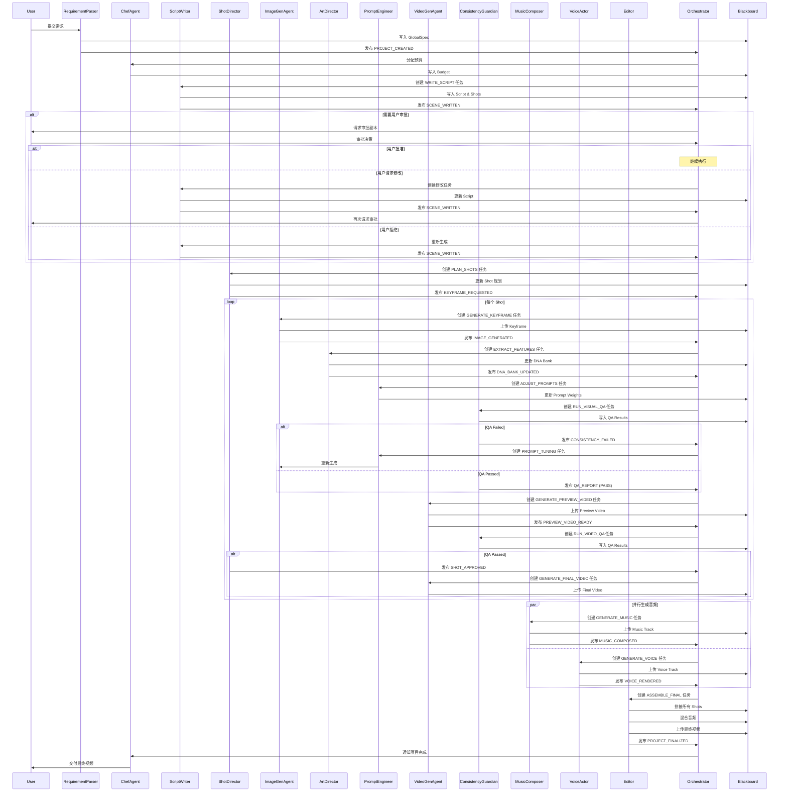
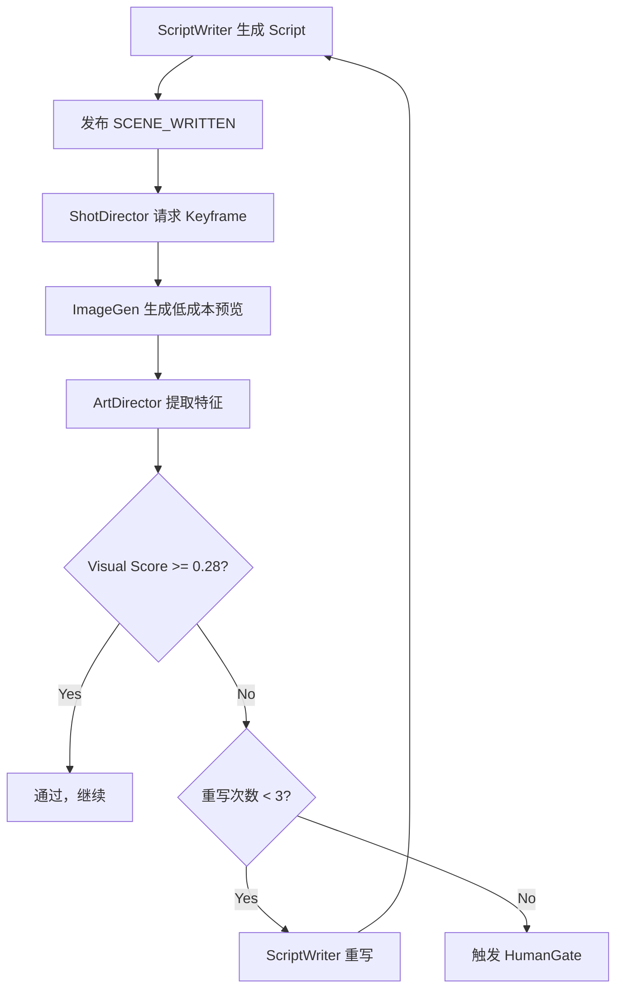
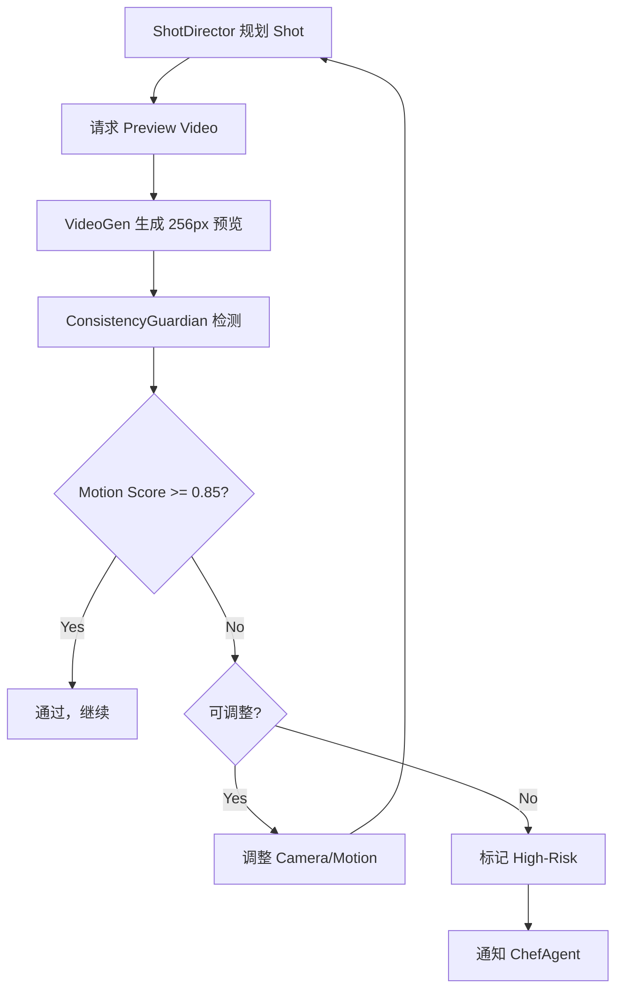
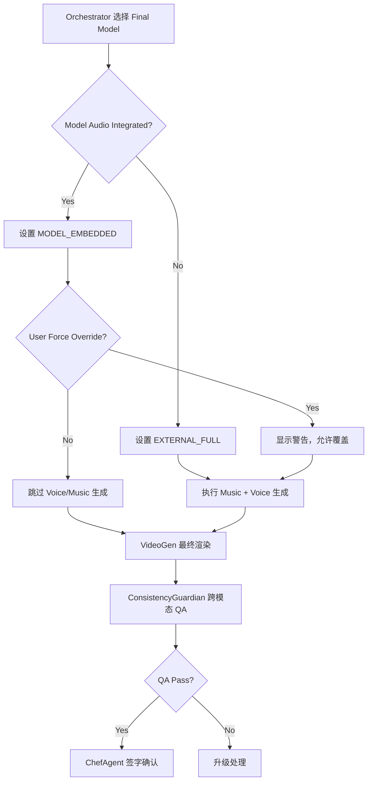
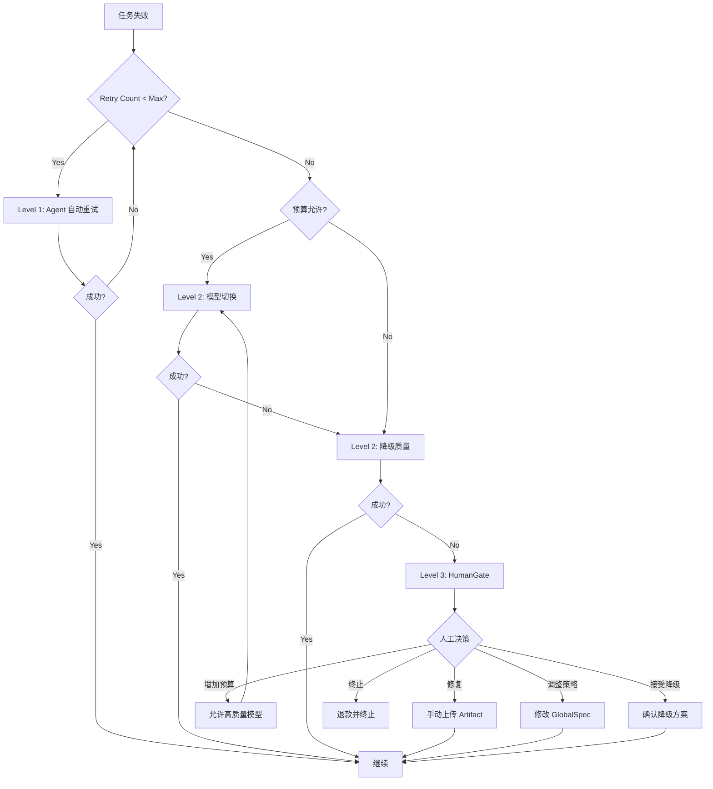

# Design Document

## Overview

LivingAgentPipeline v2.0 是一个基于事件驱动架构的多 Agent AI 视频生成系统。系统采用 Shared Blackboard 作为单一事实来源，通过 Event Bus 实现 Agent 间的松耦合协作，支持从用户需求输入到最终视频交付的全流程自动化。

### 核心设计原则

1. **事件驱动**: Agent 之间不直接调用，通过发布/订阅事件进行异步通信
2. **单一事实来源**: Shared Blackboard 作为所有状态数据的权威存储
3. **职责分离**: 每个 Agent 职责清晰，避免功能重叠
4. **可观测性**: 所有操作可追溯，支持成本核算和性能分析
5. **容错设计**: 多层次的自动修复和降级策略
6. **模型解耦**: 通过 Adapter 模式隔离不同 AI 模型的实现细节

### 系统分层架构

```
┌─────────────────────────────────────────────────────────┐
│                    L1: Interaction Layer                 │
│              RequirementParser Agent                     │
└─────────────────────────────────────────────────────────┘
                            ↓
┌─────────────────────────────────────────────────────────┐
│              L2: Cognitive Multi-Agent Layer             │
│  ┌──────────────┐  ┌──────────────┐  ┌──────────────┐  │
│  │ ChefAgent    │  │ ScriptWriter │  │ ShotDirector │  │
│  └──────────────┘  └──────────────┘  └──────────────┘  │
│  ┌──────────────┐  ┌──────────────┐  ┌──────────────┐  │
│  │ ArtDirector  │  │PromptEngineer│  │ Editor       │  │
│  └──────────────┘  └──────────────┘  └──────────────┘  │
│  ┌──────────────┐  ┌──────────────┐  ┌──────────────┐  │
│  │ ImageGen     │  │ VideoGen     │  │ MusicComposer│  │
│  └──────────────┘  └──────────────┘  └──────────────┘  │
│  ┌──────────────┐  ┌──────────────┐                    │
│  │ VoiceActor   │  │ Consistency  │                    │
│  │              │  │ Guardian     │                    │
│  └──────────────┘  └──────────────┘                    │
└─────────────────────────────────────────────────────────┘
                            ↓
┌─────────────────────────────────────────────────────────┐
│           L3: Infrastructure & Model Runtime             │
│  Orchestrator | Event Bus | Shared Blackboard           │
│  Storage Service | ModelRouter | Adapters               │
└─────────────────────────────────────────────────────────┘
```

## Architecture

### 核心组件架构


#### 1. Shared Blackboard（共享黑板）

**技术选型**: PostgreSQL (JSONB) + Redis (缓存) + S3 (Artifacts)

**核心职责**:
- 存储项目全局状态（globalSpec、budget、dna_bank）
- 管理 shot 级别数据和依赖关系
- 维护 artifact 索引和元数据
- 记录版本历史和变更日志
- 提供锁机制防止并发冲突

**数据结构**:
```json
{
  "project_id": "PROJ-2025-1116-001",
  "version": 5,
  "status": "RENDERING",
  "globalSpec": {
    "title": "Rain and Warmth",
    "duration": 30,
    "aspect_ratio": "9:16",
    "quality_tier": "balanced",
    "style": {
      "tone": "warm",
      "palette": ["#2b3a67", "#cfa66b"],
      "visual_dna_version": 3
    },
    "characters": ["C1_girl", "C2_stranger"]
  },
  "budget": {
    "total": 120.0,
    "used": 67.5,
    "remaining": 52.5,
    "predicted_final": 95.0
  },
  "dna_bank": {
    "C1_girl": {
      "embeddings": [
        {
          "version": 1,
          "weight": 0.2,
          "source": "S01_keyframe_mid",
          "confidence": 0.88,
          "timestamp": "2025-11-16T10:05:00Z"
        },
        {
          "version": 2,
          "weight": 0.5,
          "source": "S02_keyframe_end",
          "confidence": 0.94,
          "timestamp": "2025-11-16T10:12:00Z"
        },
        {
          "version": 3,
          "weight": 0.3,
          "source": "S03_keyframe_start",
          "confidence": 0.91,
          "timestamp": "2025-11-16T10:18:00Z"
        }
      ],
      "merge_strategy": "weighted_average",
      "current_confidence": 0.92
    }
  },
  "shots": {
    "S01": {
      "index": 1,
      "status": "COMPLETED",
      "duration": 6,
      "dependencies": [],
      "script": {
        "description": "Rainy street, girl walks alone",
        "mood_tags": ["lonely", "soft"],
        "voice_lines": []
      },
      "keyframes": {
        "start": "s3://artifacts/PROJ-001/S01_start.png",
        "mid": "s3://artifacts/PROJ-001/S01_mid.png",
        "end": "s3://artifacts/PROJ-001/S01_end.png"
      },
      "preview_video": "s3://artifacts/PROJ-001/S01_preview.mp4",
      "final_video": "s3://artifacts/PROJ-001/S01_final.mp4",
      "audio": {
        "strategy": "EXTERNAL_FULL",
        "music": "s3://artifacts/PROJ-001/S01_music.wav",
        "voice": null
      },
      "qa_results": {
        "clip_similarity": 0.34,
        "face_identity": 0.89,
        "temporal_coherence": 0.91,
        "status": "PASS"
      }
    }
  },
  "tasks": {
    "T001": {
      "type": "WRITE_SCRIPT",
      "status": "COMPLETED",
      "assigned_to": "ScriptWriter",
      "priority": 5,
      "created_at": "2025-11-16T10:00:00Z",
      "completed_at": "2025-11-16T10:02:30Z",
      "cost": 0.05
    }
  },
  "locks": {
    "global_style": null,
    "dna_bank": null,
    "shots": {}
  },
  "artifact_index": {
    "s3://artifacts/PROJ-001/S01_start.png": {
      "seed": 123456,
      "model": "sdxl-1.0",
      "model_version": "1.0.2",
      "prompt": "...",
      "cost": 0.02,
      "created_at": "2025-11-16T10:05:00Z",
      "uses": 3
    }
  },
  "error_log": [],
  "change_log": [
    {
      "version": 5,
      "timestamp": "2025-11-16T10:18:00Z",
      "actor": "ArtDirector",
      "change": "Updated DNA bank for C1_girl",
      "causation_event_id": "EV-IMG-0003"
    }
  ]
}
```


#### 2. Event Bus（事件总线）

**技术选型**: Kafka / Redis Streams / RabbitMQ

**核心事件类型（新增用户审批相关）**:

| 事件类型 | 发布者 | 订阅者 | 说明 |
|---------|--------|--------|------|
| USER_APPROVAL_REQUIRED | Agent | Orchestrator, UI | 请求用户审批 |
| USER_APPROVED | UI | Orchestrator | 用户批准 |
| USER_REVISION_REQUESTED | UI | Orchestrator, Agent | 用户请求修改 |
| USER_REJECTED | UI | Orchestrator, Agent | 用户拒绝 |

**事件标准格式**:
```json
{
  "event_id": "EV-20251116-0042",
  "project_id": "PROJ-2025-1116-001",
  "type": "IMAGE_GENERATED",
  "actor": "ImageGenAgent",
  "causation_id": "EV-20251116-0041",
  "timestamp": "2025-11-16T10:05:30Z",
  "payload": {
    "shot_id": "S02",
    "artifact_url": "s3://artifacts/PROJ-001/S02_keyframe.png",
    "seed": 432198,
    "model": "sdxl-1.0",
    "clip_similarity": 0.34,
    "face_identity": 0.89
  },
  "blackboard_pointer": "/projects/PROJ-001/shots/S02/keyframes/mid",
  "metadata": {
    "cost": 0.02,
    "latency_ms": 3200,
    "retry_count": 0
  }
}
```

**核心事件类型**:

| 事件类型 | 发布者 | 订阅者 | 说明 |
|---------|--------|--------|------|
| PROJECT_CREATED | RequirementParser | ChefAgent, Orchestrator | 项目创建 |
| SCENE_WRITTEN | ScriptWriter | ShotDirector | 剧本完成 |
| SHOT_PLANNED | ShotDirector | ImageGenAgent | 分镜规划完成 |
| KEYFRAME_REQUESTED | ShotDirector | ImageGenAgent | 请求生成关键帧 |
| IMAGE_GENERATED | ImageGenAgent | ArtDirector, ConsistencyGuardian | 图像生成完成 |
| DNA_BANK_UPDATED | ArtDirector | PromptEngineer | DNA 更新 |
| PREVIEW_VIDEO_REQUESTED | ShotDirector | VideoGenAgent | 请求预览视频 |
| PREVIEW_VIDEO_READY | VideoGenAgent | ConsistencyGuardian | 预览视频完成 |
| QA_REPORT | ConsistencyGuardian | ChefAgent, ShotDirector | QA 检测报告 |
| CONSISTENCY_FAILED | ConsistencyGuardian | PromptEngineer, ChefAgent | 一致性检测失败 |
| MUSIC_COMPOSED | MusicComposer | Editor | 音乐生成完成 |
| VOICE_RENDERED | VoiceActor | Editor | 配音完成 |
| SHOT_APPROVED | ShotDirector | Orchestrator | 镜头审批通过 |
| FINAL_VIDEO_REQUESTED | Orchestrator | VideoGenAgent | 请求最终渲染 |
| FINAL_VIDEO_READY | VideoGenAgent | Editor | 最终视频完成 |
| PROJECT_FINALIZED | Editor | ChefAgent | 项目完成 |
| HUMAN_GATE_TRIGGERED | ChefAgent | HumanGate | 触发人工介入 |
| USER_APPROVAL_REQUIRED | Agent | Orchestrator, UI | 请求用户审批 |
| USER_APPROVED | UI | Orchestrator | 用户批准继续 |
| USER_REVISION_REQUESTED | UI | Orchestrator, Agent | 用户请求修改 |
| USER_REJECTED | UI | Orchestrator, Agent | 用户拒绝重做 |

**事件处理原则**:
1. Agent 不直接调用其他 Agent，仅通过事件通信
2. 每个事件必须包含 causation_id 用于链路追踪
3. 事件发布后同步写入 Blackboard 的 change_log
4. 关键事件需记录成本和性能指标
5. 支持事件重放用于调试和审计

#### 3. Task vs Event 关系模型

**概念区分**:
- **Event（事件）**: Agent 间的异步通知机制，表示"某事已发生"
- **Task（任务）**: Orchestrator 分配给 Agent 的工作单元，表示"需要做某事"

**关系流程**:
```
1. Event 触发 → Orchestrator 接收
2. Orchestrator 创建 Task → 写入 Blackboard
3. Agent 拉取 Task → 执行工作
4. Agent 完成 Task → 发布 Event
5. Event 触发新的 Task → 循环
```

**Task 数据结构**:
```json
{
  "task_id": "T042",
  "type": "GENERATE_KEYFRAME",
  "status": "IN_PROGRESS",
  "assigned_to": "ImageGenAgent",
  "priority": 4,
  "dependencies": ["T041"],
  "input": {
    "shot_id": "S02",
    "frame_type": "start",
    "prompt": "...",
    "dna_tokens": ["C1_girl_v3"],
    "model": "sdxl-1.0"
  },
  "output": null,
  "retry_count": 0,
  "max_retries": 3,
  "created_at": "2025-11-16T10:05:00Z",
  "started_at": "2025-11-16T10:05:10Z",
  "estimated_cost": 0.02,
  "actual_cost": null
}
```

**任务状态机**:
```
PENDING → IN_PROGRESS → COMPLETED
                ↓
              FAILED → RETRY → IN_PROGRESS
                ↓
            ESCALATED (to HumanGate)
```


## Components and Interfaces

### Agent 详细设计

#### 1. ChefAgent（总监 Agent）

**职责**: 项目总指挥、预算控制、熔断决策、人工决策入口

**输入事件**:
- PROJECT_CREATED
- CONSISTENCY_FAILED
- COST_OVERRUN_WARNING
- HUMAN_APPROVAL_REQUEST

**输出事件**:
- BUDGET_ALLOCATED
- STRATEGY_UPDATE
- FORCE_ABORT
- HUMAN_GATE_TRIGGERED

**核心能力**:
```python
class ChefAgent:
    def allocate_budget(self, project_spec):
        """根据项目规格分配预算"""
        base_budget = project_spec.duration * 3.0  # $3/秒基准
        quality_multiplier = {
            "high": 1.5,
            "balanced": 1.0,
            "fast": 0.6
        }
        return base_budget * quality_multiplier[project_spec.quality_tier]
    
    def evaluate_escalation(self, failure_report):
        """评估是否需要人工介入"""
        if failure_report.retry_count >= 3:
            return "HUMAN_GATE"
        if failure_report.cost_impact > 20.0:
            return "HUMAN_GATE"
        if failure_report.severity == "critical":
            return "HUMAN_GATE"
        return "AUTO_RETRY"
    
    def adjust_strategy(self, budget_status):
        """动态调整项目策略"""
        if budget_status.used / budget_status.total > 0.8:
            return {
                "action": "REDUCE_QUALITY",
                "params": {"switch_to": "fast_models"}
            }
        return {"action": "CONTINUE"}
```

**KPIs**:
- cost_overrun_rate: 预算超支率
- human_intervention_rate: 人工介入率
- project_completion_rate: 项目完成率
- avg_decision_latency: 平均决策延迟

---

#### 2. RequirementParser Agent

**职责**: 解析用户需求，生成 GlobalSpec

**输入**: 用户文本、参考图片、参考视频、参考音乐

**输出事件**: PROJECT_CREATED

**核心能力**:
```python
class RequirementParser:
    def parse_user_input(self, user_input):
        """解析用户输入"""
        spec = {
            "title": self.extract_title(user_input.text),
            "duration": self.estimate_duration(user_input.text),
            "aspect_ratio": user_input.aspect or "9:16",
            "quality_tier": user_input.quality or "balanced",
            "style": self.analyze_style(user_input.references),
            "characters": self.identify_characters(user_input.text),
            "mood": self.extract_mood(user_input.text)
        }
        
        confidence = self.calculate_confidence(spec)
        if confidence < 0.6:
            self.trigger_human_clarification(spec)
        
        return spec
```

---

#### 3. ScriptWriter Agent

**职责**: 编写剧本、分镜、情绪标注

**输入事件**: PROJECT_CREATED, REWRITE_SCENE

**输出事件**: SCENE_WRITTEN

**核心能力**:
```python
class ScriptWriter:
    def generate_script(self, global_spec):
        """生成剧本和分镜"""
        scenes = self.llm_generate_scenes(global_spec)
        shots = []
        
        for scene in scenes:
            scene_shots = self.break_into_shots(
                scene,
                target_duration=global_spec.duration / len(scenes)
            )
            shots.extend(scene_shots)
        
        # 添加情绪标注和时间窗口
        for shot in shots:
            shot["mood_tags"] = self.tag_emotions(shot.description)
            shot["time_window"] = self.calculate_timing(shot)
            shot["voice_cues"] = self.extract_dialogue(shot)
        
        return {"scenes": scenes, "shots": shots}
```

**失败策略**:
- 若 visual_feasibility < 0.28，自动重写（最多 3 次）
- 超过重写次数，触发 HUMAN_GATE

**用户审批处理**:
```python
def handle_user_revision(self, revision_request):
    """处理用户修改请求"""
    original_script = self.blackboard.get_script(revision_request.project_id)
    revision_notes = revision_request.revision_notes
    
    # 基于用户意见修改剧本
    revised_script = self.llm_revise_script(
        original_script,
        revision_notes,
        preserve_structure=True  # 保留基本结构
    )
    
    # 更新 Blackboard
    self.blackboard.update_script(
        revision_request.project_id,
        revised_script,
        revision_reason=revision_notes
    )
    
    # 发布更新事件
    self.event_bus.publish(Event(
        type="SCENE_WRITTEN",
        payload={"script": revised_script, "is_revision": True}
    ))
```

---

#### 4. ShotDirector Agent

**职责**: Shot 级别设计、镜头语言、运镜规划

**输入事件**: SCENE_WRITTEN, DNA_BANK_UPDATED

**输出事件**: KEYFRAME_REQUESTED, PREVIEW_VIDEO_REQUESTED, SHOT_APPROVED

**核心能力**:
```python
class ShotDirector:
    def plan_shot(self, shot_spec, dna_bank):
        """规划单个镜头"""
        return {
            "shot_id": shot_spec.id,
            "camera": self.select_camera_movement(shot_spec.mood),
            "duration": shot_spec.duration,
            "keyframe_count": self.calculate_keyframes(shot_spec.duration),
            "motion_plan": self.design_motion(shot_spec),
            "visual_hooks": self.identify_visual_elements(shot_spec),
            "dna_requirements": self.extract_dna_needs(shot_spec, dna_bank)
        }
    
    def request_preview(self, shot_id):
        """请求低分辨率预览"""
        return {
            "shot_id": shot_id,
            "resolution": 256,
            "fps": 12,
            "quality": "preview"
        }
```


---

#### 5. ArtDirector Agent

**职责**: 视觉 DNA 管理、特征提取、prompt 权重调整

**输入事件**: IMAGE_GENERATED, PREVIEW_VIDEO_READY

**输出事件**: DNA_BANK_UPDATED, PROMPT_ADJUSTMENT

**核心能力**:
```python
class ArtDirector:
    def extract_features(self, artifact_url):
        """提取视觉特征"""
        image = self.load_image(artifact_url)
        return {
            "face_embedding": self.extract_face(image),
            "palette": self.extract_colors(image),
            "texture": self.extract_texture(image),
            "composition": self.analyze_composition(image),
            "confidence": self.calculate_confidence(image)
        }
    
    def update_dna_bank(self, character_id, new_features, source):
        """更新 DNA Bank"""
        current_dna = self.blackboard.get_dna(character_id)
        
        if new_features.confidence < 0.6:
            self.trigger_manual_review(character_id, new_features)
            return
        
        # 加权平均合并策略
        merged = self.weighted_merge(
            current_dna.embeddings,
            new_features,
            strategy="weighted_average"
        )
        
        # 添加新版本
        current_dna.embeddings.append({
            "version": len(current_dna.embeddings) + 1,
            "weight": self.calculate_weight(new_features.confidence),
            "source": source,
            "confidence": new_features.confidence,
            "timestamp": datetime.now()
        })
        
        # 重新计算权重分布
        self.rebalance_weights(current_dna.embeddings)
        
        return merged
    
    def suggest_prompt_adjustments(self, dna_version, target_shot):
        """建议 prompt 调整"""
        return {
            "dna_tokens": [f"{char}_v{dna_version}" for char in target_shot.characters],
            "weight_adjustments": {
                "character_consistency": 1.2,
                "color_palette": 1.1
            },
            "negative_prompts": ["inconsistent_face", "color_shift"]
        }
```

**DNA 合并策略**:
1. **weighted_average**: 按置信度加权平均（默认）
2. **latest_priority**: 最新特征优先
3. **confidence_threshold**: 仅保留高置信度特征
4. **manual_selection**: 人工选择保留版本

---

#### 6. PromptEngineer Agent

**职责**: 编织最终 prompt、A/B 测试、模板管理

**输入事件**: DNA_BANK_UPDATED, KEYFRAME_REQUESTED

**输出**: final_prompt, seed, control_config

**核心能力**:
```python
class PromptEngineer:
    def __init__(self):
        self.template_library = self.load_templates()
    
    def compose_prompt(self, shot_spec, dna_tokens, global_style):
        """组合最终 prompt"""
        # 选择基础模板
        template = self.select_template(
            shot_spec.type,
            shot_spec.mood_tags
        )
        
        # 注入变量
        prompt = template.format(
            character=shot_spec.characters[0],
            action=shot_spec.description,
            mood=", ".join(shot_spec.mood_tags),
            style=global_style.tone
        )
        
        # 注入 DNA tokens
        prompt = f"{prompt}, {', '.join(dna_tokens)}"
        
        # 添加风格权重
        prompt = self.apply_weights(prompt, global_style.palette)
        
        # 添加 negative prompt
        negative = self.build_negative_prompt(shot_spec)
        
        return {
            "positive": prompt,
            "negative": negative,
            "seed": self.generate_seed(),
            "cfg_scale": 7.5,
            "steps": 30
        }
    
    def ab_test_prompts(self, base_prompt, variations=2):
        """A/B 测试 prompt 变体"""
        prompts = [base_prompt]
        for i in range(variations):
            variant = self.create_variant(base_prompt, strategy=f"variant_{i}")
            prompts.append(variant)
        
        # 并行生成
        results = self.parallel_generate(prompts)
        
        # 选择最佳
        best = self.select_best(results, criteria="clip_similarity")
        return best
```

**模板库结构**:
```json
{
  "templates": {
    "character_portrait": {
      "base": "{character}, {mood}, {style} lighting, portrait shot",
      "variations": ["close-up", "medium shot", "dramatic"],
      "negative": "blurry, distorted, multiple faces"
    },
    "action_scene": {
      "base": "{character} {action}, {mood} atmosphere, {style}",
      "variations": ["dynamic", "cinematic", "realistic"],
      "negative": "static, boring, low quality"
    }
  }
}
```


---

#### 7. ImageGen Agent

**职责**: 图像生成、ControlNet、embedding 输出

**输入事件**: KEYFRAME_REQUESTED, PROMPT_ADJUSTMENT

**输出事件**: IMAGE_GENERATED

**核心能力**:
```python
class ImageGenAgent:
    def __init__(self):
        self.adapters = {
            "sdxl-1.0": SDXLAdapter(),
            "midjourney": MidjourneyAdapter(),
            "dalle3": DALLE3Adapter()
        }
    
    def generate_image(self, task):
        """生成图像"""
        model = task.input.model
        adapter = self.adapters[model]
        
        result = adapter.generate(
            prompt=task.input.prompt,
            negative_prompt=task.input.negative,
            seed=task.input.seed,
            control_map=task.input.control_map,
            width=1024,
            height=1024
        )
        
        # 提取 embedding
        embedding = self.extract_embedding(result.image)
        
        # 计算质量指标
        clip_score = self.calculate_clip_similarity(
            result.image,
            task.input.prompt
        )
        
        # 上传到 S3
        artifact_url = self.storage.upload(
            result.image,
            metadata={
                "seed": task.input.seed,
                "model": model,
                "prompt": task.input.prompt
            }
        )
        
        return {
            "artifact_url": artifact_url,
            "embedding": embedding,
            "clip_similarity": clip_score,
            "cost": adapter.calculate_cost(result)
        }
```

**失败策略**:
1. clip_similarity < 0.25 → 调整 prompt 重试（最多 2 次）
2. 模型 API 错误 → 切换备用模型
3. 仍失败 → 上报 ChefAgent

---

#### 8. VideoGen Agent

**职责**: 视频生成、运动注入、时间连贯性

**输入事件**: PREVIEW_VIDEO_REQUESTED, FINAL_VIDEO_REQUESTED

**输出事件**: PREVIEW_VIDEO_READY, FINAL_VIDEO_READY

**核心能力**:
```python
class VideoGenAgent:
    def __init__(self):
        self.adapters = {
            "sora2": Sora2Adapter(),
            "veo3.1": Veo3Adapter(),
            "runway": RunwayAdapter(),
            "pika": PikaAdapter()
        }
    
    def generate_video(self, task):
        """生成视频"""
        model = task.input.model
        adapter = self.adapters[model]
        
        # 检查模型是否支持集成音频
        audio_strategy = self.determine_audio_strategy(
            adapter.capabilities,
            task.input.audio_preference
        )
        
        result = adapter.generate(
            start_frame=task.input.start_frame,
            end_frame=task.input.end_frame,
            duration=task.input.duration,
            motion_hint=task.input.motion_hint,
            audio_enabled=audio_strategy.use_model_audio
        )
        
        # 计算时间连贯性
        temporal_score = self.analyze_temporal_coherence(result.video)
        
        # 提取每帧 embedding
        frame_embeddings = self.extract_frame_embeddings(result.video)
        
        artifact_url = self.storage.upload(result.video)
        
        return {
            "artifact_url": artifact_url,
            "audio_info": result.audio_info,
            "temporal_coherence": temporal_score,
            "frame_embeddings": frame_embeddings,
            "cost": adapter.calculate_cost(result)
        }
    
    def determine_audio_strategy(self, model_capabilities, user_pref):
        """确定音频策略"""
        if model_capabilities.audio_integrated:
            if user_pref == "keep_model_audio":
                return AudioStrategy.MODEL_EMBEDDED
            elif user_pref == "replace_audio":
                return AudioStrategy.EXTERNAL_FULL_REPLACE
            else:
                return AudioStrategy.HYBRID_OVERLAY
        else:
            return AudioStrategy.EXTERNAL_FULL
```

**Audio Strategy 决策表**:

| 模型能力 | 用户偏好 | 策略 | 说明 |
|---------|---------|------|------|
| audio_integrated=true | keep_model_audio | MODEL_EMBEDDED | 使用模型音频 |
| audio_integrated=true | replace_audio | EXTERNAL_FULL_REPLACE | 替换（显示警告） |
| audio_integrated=true | default | HYBRID_OVERLAY | 保留模型音频+低音量BGM |
| audio_integrated=false | any | EXTERNAL_FULL | 完全外部音频 |


---

#### 9. MusicComposer Agent

**职责**: 音乐生成、stems 导出、markers 标注

**输入事件**: SHOT_MARKERS, GLOBAL_SPEC

**输出事件**: MUSIC_COMPOSED

**核心能力**:
```python
class MusicComposer:
    def compose_music(self, global_spec, shot_markers):
        """生成音乐"""
        # 检查是否需要生成音乐
        if self.should_skip_music(global_spec):
            return None
        
        result = self.music_api.generate(
            mood=global_spec.mood,
            duration=global_spec.duration,
            bpm_hint=self.estimate_bpm(global_spec.mood),
            style=global_spec.style.tone,
            markers=shot_markers
        )
        
        # 生成 stems
        stems = self.separate_stems(result.audio)
        
        # 标注 markers（强拍、情绪转折点）
        markers = self.annotate_markers(result.audio, shot_markers)
        
        # 提取 music embedding
        embedding = self.extract_music_embedding(result.audio)
        
        return {
            "track_url": self.storage.upload(result.audio),
            "stems": {
                "piano": self.storage.upload(stems.piano),
                "strings": self.storage.upload(stems.strings),
                "percussion": self.storage.upload(stems.percussion)
            },
            "bpm": result.bpm,
            "markers": markers,
            "music_embedding": embedding
        }
    
    def should_skip_music(self, global_spec):
        """判断是否跳过音乐生成"""
        if global_spec.user_options.get("disable_music"):
            return True
        if global_spec.video_model_audio_integrated:
            return True  # 使用视频模型自带音乐
        return False
```

---

#### 10. VoiceActor Agent

**职责**: TTS、声音克隆、音素时间对齐

**输入事件**: SCRIPT_LINES, VOICE_TOKEN

**输出事件**: VOICE_RENDERED

**核心能力**:
```python
class VoiceActor:
    def synthesize_voice(self, script_line, voice_token, consent_proof):
        """合成语音"""
        # 验证 consent
        if not self.verify_consent(voice_token, consent_proof):
            raise ConsentError("Voice cloning requires consent")
        
        result = self.tts_api.synthesize(
            text=script_line.text,
            voice_id=voice_token,
            speed=script_line.speed or 1.0,
            emotion=script_line.emotion
        )
        
        # 提取音素时间戳
        phoneme_timestamps = self.align_phonemes(
            result.audio,
            script_line.text
        )
        
        # 提取 voice embedding
        voice_embedding = self.extract_voice_embedding(result.audio)
        
        # 计算 WER（Word Error Rate）
        wer = self.calculate_wer(result.audio, script_line.text)
        
        return {
            "voice_url": self.storage.upload(result.audio),
            "phoneme_timestamps": phoneme_timestamps,
            "voice_embedding": voice_embedding,
            "wer": wer,
            "duration": result.duration
        }
    
    def estimate_lip_sync_quality(self, phoneme_timestamps, video_frames):
        """估算口型同步质量"""
        # 基于音素时间戳和视频帧的对齐度
        alignment_score = self.calculate_alignment(
            phoneme_timestamps,
            video_frames
        )
        return alignment_score
```

---

#### 11. Editor Agent（新增）

**职责**: 多 shot 拼接、音频混合、转场效果、最终输出

**输入事件**: FINAL_VIDEO_READY (all shots), MUSIC_COMPOSED, VOICE_RENDERED

**输出事件**: PROJECT_FINALIZED

**核心能力**:
```python
class EditorAgent:
    def assemble_final_video(self, project_id):
        """组装最终视频"""
        project = self.blackboard.get_project(project_id)
        shots = self.get_all_shots(project)
        
        # 按顺序拼接 shots
        video_timeline = self.concatenate_shots(shots)
        
        # 添加转场效果
        video_timeline = self.add_transitions(
            video_timeline,
            transition_type="crossfade",
            duration=0.5
        )
        
        # 混合音频
        audio_timeline = self.mix_audio(
            music=project.music,
            voice=project.voice_tracks,
            video_audio=self.extract_video_audio(shots),
            strategy=project.audio_strategy
        )
        
        # 合成最终视频
        final_video = self.render_final(
            video=video_timeline,
            audio=audio_timeline,
            resolution=project.globalSpec.resolution,
            fps=project.globalSpec.fps
        )
        
        # 生成元数据
        metadata = self.generate_metadata(project, shots)
        
        return {
            "final_video_url": self.storage.upload(final_video),
            "metadata": metadata,
            "total_duration": final_video.duration,
            "total_cost": project.budget.used
        }
    
    def mix_audio(self, music, voice, video_audio, strategy):
        """混合音频"""
        if strategy == AudioStrategy.MODEL_EMBEDDED:
            # 仅使用视频模型音频
            return video_audio
        
        elif strategy == AudioStrategy.HYBRID_OVERLAY:
            # 视频音频 + 低音量 BGM
            bgm = self.adjust_volume(music, volume=0.3)
            return self.overlay_audio(video_audio, bgm)
        
        elif strategy == AudioStrategy.EXTERNAL_FULL:
            # 完全外部音频
            mixed = self.mix_tracks([music, voice])
            # 音频 ducking（对话时降低音乐音量）
            mixed = self.apply_ducking(mixed, voice_timestamps=voice.timestamps)
            return mixed
        
        elif strategy == AudioStrategy.EXTERNAL_FULL_REPLACE:
            # 替换模型音频（警告用户）
            return self.mix_tracks([music, voice])
    
    def sync_audio_to_video(self, audio, video, markers):
        """音频与视频同步"""
        # 基于 markers 对齐
        for marker in markers:
            if marker.type == "beat":
                # 在强拍处对齐剪辑点
                self.align_cut_to_beat(video, marker.timestamp)
            elif marker.type == "dialogue":
                # 对齐口型
                self.align_lip_sync(video, audio, marker.phoneme_timestamps)
        
        return video
```


---

#### 12. ImageEditAgent（新增）

**职责**: 图像编辑、视角调整、局部修正

**输入事件**: USER_EDIT_REQUESTED, ERROR_CORRECTION_REQUESTED

**输出事件**: IMAGE_EDITED

**核心能力**:
```python
class ImageEditAgent:
    def __init__(self):
        self.adapters = {
            "qwen-image-edit": QwenImageEditAdapter(),
            "controlnet-inpaint": ControlNetInpaintAdapter(),
            "instruct-pix2pix": InstructPix2PixAdapter()
        }
    
    def edit_image(self, edit_request):
        """基于用户指令编辑图像"""
        original_image = self.load_image(edit_request.image_url)
        instruction = edit_request.instruction
        
        # 选择合适的编辑模型
        adapter = self.select_adapter(instruction)
        
        result = adapter.edit(
            image=original_image,
            instruction=instruction,
            preserve_identity=True,
            strength=0.7
        )
        
        # 验证编辑质量
        quality_score = self.evaluate_edit_quality(
            original_image,
            result.edited_image,
            instruction
        )
        
        if quality_score < 0.7:
            return self.retry_with_alternative(edit_request)
        
        return {
            "edited_image_url": self.storage.upload(result.edited_image),
            "quality_score": quality_score,
            "changes_applied": result.changes_summary
        }
    
    def select_adapter(self, instruction):
        """根据指令类型选择编辑模型"""
        if "视角" in instruction or "angle" in instruction.lower():
            return self.adapters["qwen-image-edit"]
        elif "修复" in instruction or "inpaint" in instruction.lower():
            return self.adapters["controlnet-inpaint"]
        else:
            return self.adapters["instruct-pix2pix"]
```

**编辑类型支持**:
- 视角调整：改变相机角度和透视
- 局部修改：修改人物表情、姿态、服装
- 细节优化：修复手部、面部细节
- 风格调整：调整光影、色调

**KPIs**:
- edit_success_rate: 编辑成功率
- quality_improvement: 质量提升度
- avg_edit_time: 平均编辑时间
- cost_per_edit: 每次编辑成本

---

#### 13. ErrorCorrectionAgent（新增）

**职责**: 错误检测、智能修复、质量保障

**输入事件**: IMAGE_GENERATED, VIDEO_GENERATED, USER_ERROR_REPORTED

**输出事件**: ERROR_DETECTED, ERROR_CORRECTED

**核心能力**:
```python
class ErrorCorrectionAgent:
    def detect_errors(self, artifact):
        """自动检测视觉错误"""
        errors = []
        
        # 人物姿态检测
        pose_errors = self.check_pose_validity(artifact)
        if pose_errors:
            errors.append({
                "type": "INVALID_POSE",
                "severity": "high",
                "description": "人物姿态不自然",
                "location": pose_errors.location,
                "suggested_fix": "pose_control_regenerate"
            })
        
        # 手部质量检测
        hand_errors = self.check_hand_quality(artifact)
        if hand_errors:
            errors.append({
                "type": "HAND_DEFECT",
                "severity": "medium",
                "description": "手部细节错误",
                "location": hand_errors.location,
                "suggested_fix": "inpaint_hands"
            })
        
        # 面部质量检测
        face_errors = self.check_face_quality(artifact)
        if face_errors:
            errors.append({
                "type": "FACE_DEFECT",
                "severity": "high",
                "description": "面部特征错误",
                "location": face_errors.location,
                "suggested_fix": "face_restoration"
            })
        
        return errors
    
    def correct_error(self, error, artifact):
        """智能修复错误"""
        if error.type == "HAND_DEFECT":
            return self.inpaint_hand(artifact, error.location)
        
        elif error.type == "FACE_DEFECT":
            return self.restore_face(
                artifact,
                error.location,
                identity_embedding=self.get_character_dna()
            )
        
        elif error.type == "INVALID_POSE":
            correct_pose = self.suggest_correct_pose(error.description)
            return self.regenerate_with_pose_control(artifact, correct_pose)
        
        else:
            return self.generic_fix(artifact, error)
    
    def handle_user_error_report(self, user_annotation):
        """处理用户标注的错误"""
        artifact = self.load_artifact(user_annotation.artifact_id)
        
        # 尝试修复
        fixed_artifact = self.correct_error(
            user_annotation.error,
            artifact
        )
        
        # 验证修复效果
        if self.verify_fix(fixed_artifact, user_annotation):
            return {"status": "FIXED", "artifact": fixed_artifact}
        else:
            return {"status": "FAILED", "escalate": True}
```

**错误检测能力**:
- 姿态检测：使用 OpenPose 检测骨骼点
- 手部检测：检测手指数量和形态
- 面部检测：检测五官位置和表情
- 物理检测：检测违反物理规律的情况

**修复策略**:
1. Level 1: 局部 inpainting（优先）
2. Level 2: ControlNet 控制重生成
3. Level 3: 完全重新生成
4. Level 4: 人工介入

**KPIs**:
- error_detection_rate: 错误检测率
- auto_fix_success_rate: 自动修复成功率
- false_positive_rate: 误报率
- avg_fix_time: 平均修复时间

---

#### 14. ConsistencyGuardian Agent

**职责**: 全链路 QA、自动修复、质量把关

**输入事件**: IMAGE_GENERATED, PREVIEW_VIDEO_READY, MUSIC_COMPOSED, VOICE_RENDERED

**输出事件**: QA_REPORT, CONSISTENCY_FAILED, AUTO_FIX_REQUEST

**核心能力**:
```python
class ConsistencyGuardian:
    def run_qa_checks(self, artifact, artifact_type, project):
        """执行 QA 检测"""
        thresholds = self.get_dynamic_thresholds(
            project.globalSpec.quality_tier,
            project.budget.remaining
        )
        
        results = {}
        
        if artifact_type == "image":
            results["clip_similarity"] = self.check_clip_similarity(
                artifact,
                artifact.prompt,
                threshold=thresholds.clip_similarity
            )
            results["face_identity"] = self.check_face_identity(
                artifact,
                project.dna_bank,
                threshold=thresholds.face_identity
            )
            results["palette_consistency"] = self.check_palette(
                artifact,
                project.globalSpec.style.palette,
                threshold=thresholds.palette
            )
        
        elif artifact_type == "video":
            results["temporal_coherence"] = self.check_temporal_coherence(
                artifact,
                threshold=thresholds.temporal_coherence
            )
            results["optical_flow_smoothness"] = self.check_optical_flow(
                artifact,
                threshold=thresholds.optical_flow
            )
            results["cross_shot_continuity"] = self.check_shot_continuity(
                artifact,
                previous_shot=self.get_previous_shot(artifact.shot_id),
                threshold=thresholds.continuity
            )
        
        elif artifact_type == "audio":
            if artifact.has_voice:
                results["lip_sync"] = self.check_lip_sync(
                    artifact.voice,
                    artifact.video,
                    threshold=thresholds.lip_sync
                )
                results["wer"] = self.check_wer(
                    artifact.voice,
                    artifact.script,
                    threshold=thresholds.wer
                )
            
            if artifact.has_music:
                results["music_mood_match"] = self.check_music_mood(
                    artifact.music,
                    project.globalSpec.mood,
                    threshold=thresholds.music_mood
                )
        
        # 综合评估
        overall_status = self.evaluate_overall(results, thresholds)
        
        return {
            "status": overall_status,  # PASS / WARN / FAIL
            "checks": results,
            "recommendation": self.generate_recommendation(results)
        }
    
    def get_dynamic_thresholds(self, quality_tier, remaining_budget):
        """动态调整 QA 阈值"""
        base_thresholds = {
            "clip_similarity": 0.30,
            "face_identity": 0.75,
            "palette": 0.12,
            "temporal_coherence": 0.85,
            "optical_flow": 0.85,
            "continuity": 0.70,
            "lip_sync": 0.80,
            "wer": 0.12,
            "music_mood": 0.70
        }
        
        # 根据质量档位调整
        quality_adjustments = {
            "high": 0.05,
            "balanced": 0.0,
            "fast": -0.05
        }
        adjustment = quality_adjustments[quality_tier]
        
        # 根据预算调整（预算紧张时适当降低）
        if remaining_budget < 20:
            adjustment -= 0.03
        
        # 关键指标设置最低下限
        critical_minimums = {
            "face_identity": 0.70,  # 人脸一致性不能太低
            "lip_sync": 0.75  # 口型同步不能太差
        }
        
        adjusted = {}
        for key, base_value in base_thresholds.items():
            adjusted_value = base_value + adjustment
            # 应用最低下限
            if key in critical_minimums:
                adjusted_value = max(adjusted_value, critical_minimums[key])
            adjusted[key] = adjusted_value
        
        return adjusted
    
    def auto_fix(self, failure_report):
        """自动修复策略"""
        if failure_report.retry_count >= 3:
            return {"action": "ESCALATE_TO_HUMAN"}
        
        # 策略 1: Prompt 调整
        if failure_report.failed_checks.get("clip_similarity"):
            return {
                "action": "PROMPT_TUNE",
                "params": {
                    "increase_weight": ["subject", "style"],
                    "add_negative": ["blurry", "distorted"]
                }
            }
        
        # 策略 2: 模型切换
        if failure_report.failed_checks.get("face_identity"):
            return {
                "action": "MODEL_SWAP",
                "params": {
                    "from": "sdxl-1.0",
                    "to": "midjourney-v6"
                }
            }
        
        # 策略 3: 降级体验
        if failure_report.retry_count >= 2:
            return {
                "action": "DEGRADE_QUALITY",
                "params": {
                    "fallback": "static_image_with_motion"
                }
            }
        
        return {"action": "RETRY"}
    
    def check_shot_continuity(self, current_shot, previous_shot, threshold):
        """检查相邻 shot 的连贯性"""
        if not previous_shot:
            return {"score": 1.0, "status": "PASS"}
        
        # 比较结束帧和开始帧
        end_frame = self.extract_frame(previous_shot.video, position="end")
        start_frame = self.extract_frame(current_shot.video, position="start")
        
        # 计算视觉相似度
        visual_similarity = self.calculate_embedding_similarity(
            end_frame.embedding,
            start_frame.embedding
        )
        
        # 检测突变（光照、颜色、位置）
        lighting_jump = self.detect_lighting_change(end_frame, start_frame)
        color_jump = self.detect_color_shift(end_frame, start_frame)
        position_jump = self.detect_position_jump(end_frame, start_frame)
        
        # 综合评分
        continuity_score = (
            visual_similarity * 0.4 +
            (1 - lighting_jump) * 0.3 +
            (1 - color_jump) * 0.2 +
            (1 - position_jump) * 0.1
        )
        
        status = "PASS" if continuity_score >= threshold else "FAIL"
        
        return {
            "score": continuity_score,
            "status": status,
            "details": {
                "visual_similarity": visual_similarity,
                "lighting_jump": lighting_jump,
                "color_jump": color_jump,
                "position_jump": position_jump
            }
        }
```


---

#### 13. Orchestrator（基础设施）

**职责**: 任务调度、事件路由、模型选择、资源管理、用户审批流程控制

**核心能力**:
```python
class Orchestrator:
    def __init__(self):
        self.event_bus = EventBus()
        self.blackboard = SharedBlackboard()
        self.model_router = ModelRouter()
        self.task_queue = PriorityQueue()
    
    def handle_event(self, event):
        """处理事件并创建任务"""
        # 记录事件到 Blackboard
        self.blackboard.log_event(event)
        
        # 根据事件类型创建任务
        tasks = self.event_to_tasks(event)
        
        for task in tasks:
            # 选择模型
            task.input.model = self.model_router.select_model(
                task.type,
                quality_tier=self.blackboard.get_quality_tier(event.project_id),
                budget_remaining=self.blackboard.get_budget_remaining(event.project_id)
            )
            
            # 估算成本
            task.estimated_cost = self.model_router.estimate_cost(task)
            
            # 检查预算
            if not self.check_budget(event.project_id, task.estimated_cost):
                self.trigger_budget_warning(event.project_id)
                continue
            
            # 加入任务队列
            self.task_queue.put(task, priority=task.priority)
            
            # 写入 Blackboard
            self.blackboard.create_task(task)
    
    def dispatch_tasks(self):
        """分发任务给 Agent"""
        while not self.task_queue.empty():
            task = self.task_queue.get()
            
            # 检查依赖
            if not self.check_dependencies(task):
                self.task_queue.put(task, priority=task.priority)
                continue
            
            # 获取锁（如果需要）
            if task.requires_lock:
                lock = self.blackboard.acquire_lock(task.lock_key)
                if not lock:
                    self.task_queue.put(task, priority=task.priority)
                    continue
            
            # 分发给对应 Agent
            agent = self.get_agent(task.assigned_to)
            agent.execute_task(task)
    
    def check_approval_required(self, event):
        """检查是否需要用户审批"""
        project = self.blackboard.get_project(event.project_id)
        
        # 如果项目设置为自动模式，跳过审批
        if project.globalSpec.user_options.get("auto_mode"):
            return False
        
        # 获取审批检查点配置
        approval_checkpoints = project.globalSpec.user_options.get(
            "approval_checkpoints",
            ["SCENE_WRITTEN", "SHOT_PLANNED", "PREVIEW_VIDEO_READY", "FINAL_VIDEO_READY"]
        )
        
        return event.type in approval_checkpoints
    
    def request_user_approval(self, event):
        """请求用户审批"""
        approval_request = {
            "approval_id": f"APPR-{uuid.uuid4()}",
            "project_id": event.project_id,
            "stage": event.type,
            "content": self.extract_approval_content(event),
            "options": ["approve", "revise", "reject"],
            "created_at": datetime.now(),
            "timeout_minutes": 60
        }
        
        # 写入 Blackboard
        self.blackboard.create_approval_request(approval_request)
        
        # 发布审批请求事件
        self.event_bus.publish(Event(
            type="USER_APPROVAL_REQUIRED",
            project_id=event.project_id,
            payload=approval_request
        ))
        
        # 暂停后续任务
        self.pause_project(event.project_id)
        
        return approval_request
    
    def handle_user_decision(self, decision_event):
        """处理用户决策"""
        approval_id = decision_event.payload["approval_id"]
        decision = decision_event.payload["decision"]
        
        if decision == "approve":
            # 恢复项目执行
            self.resume_project(decision_event.project_id)
            
        elif decision == "revise":
            # 获取用户修改意见
            revision_notes = decision_event.payload.get("revision_notes", "")
            
            # 创建修改任务
            original_stage = decision_event.payload["original_stage"]
            revision_task = self.create_revision_task(
                decision_event.project_id,
                original_stage,
                revision_notes
            )
            
            # 分发修改任务
            self.task_queue.put(revision_task, priority=5)
            
        elif decision == "reject":
            # 标记为拒绝，重新执行原任务
            original_stage = decision_event.payload["original_stage"]
            retry_task = self.create_retry_task(
                decision_event.project_id,
                original_stage
            )
            
            self.task_queue.put(retry_task, priority=5)
    
    def event_to_tasks(self, event):
        """事件到任务的映射"""
        # 检查是否需要用户审批
        if self.check_approval_required(event):
            self.request_user_approval(event)
            return []  # 暂停创建后续任务
        
        mapping = {
            "SCENE_WRITTEN": [
                {"type": "PLAN_SHOTS", "assigned_to": "ShotDirector"}
            ],
            "SHOT_PLANNED": [
                {"type": "GENERATE_KEYFRAME", "assigned_to": "ImageGenAgent"}
            ],
            "IMAGE_GENERATED": [
                {"type": "EXTRACT_FEATURES", "assigned_to": "ArtDirector"},
                {"type": "RUN_VISUAL_QA", "assigned_to": "ConsistencyGuardian"}
            ],
            "DNA_BANK_UPDATED": [
                {"type": "ADJUST_PROMPTS", "assigned_to": "PromptEngineer"}
            ],
            "PREVIEW_VIDEO_READY": [
                {"type": "RUN_VIDEO_QA", "assigned_to": "ConsistencyGuardian"}
            ],
            "SHOT_APPROVED": [
                {"type": "GENERATE_FINAL_VIDEO", "assigned_to": "VideoGenAgent"}
            ],
            "ALL_SHOTS_READY": [
                {"type": "ASSEMBLE_FINAL", "assigned_to": "Editor"}
            ]
        }
        
        task_templates = mapping.get(event.type, [])
        tasks = []
        
        for template in task_templates:
            task = Task(
                type=template["type"],
                assigned_to=template["assigned_to"],
                project_id=event.project_id,
                input=self.extract_task_input(event),
                priority=self.calculate_priority(template["type"]),
                causation_event_id=event.event_id
            )
            tasks.append(task)
        
        return tasks
```

---

#### 14. ModelRouter（基础设施）

**职责**: 模型选择、成本优化、能力匹配

**核心能力**:
```python
class ModelRouter:
    def __init__(self):
        self.model_registry = self.load_model_registry()
    
    def select_model(self, task_type, quality_tier, budget_remaining):
        """选择最优模型"""
        # 获取候选模型
        candidates = self.get_candidates(task_type)
        
        # 过滤不符合质量要求的模型
        candidates = [
            m for m in candidates
            if m.quality_tier >= self.quality_tier_to_level(quality_tier)
        ]
        
        # 根据预算排序
        if budget_remaining < 30:
            # 预算紧张，优先选择便宜的
            candidates.sort(key=lambda m: m.cost_per_unit)
        else:
            # 预算充足，优先选择质量高的
            candidates.sort(key=lambda m: -m.quality_score)
        
        return candidates[0].name if candidates else None
    
    def estimate_cost(self, task):
        """估算任务成本"""
        model = self.model_registry[task.input.model]
        
        if task.type == "GENERATE_IMAGE":
            return model.cost_per_image
        elif task.type == "GENERATE_VIDEO":
            return model.cost_per_second * task.input.duration
        elif task.type == "GENERATE_VOICE":
            return model.cost_per_char * len(task.input.text)
        elif task.type == "GENERATE_MUSIC":
            return model.cost_per_second * task.input.duration
        
        return 0.0
    
    def get_model_capabilities(self, model_name):
        """获取模型能力"""
        return self.model_registry[model_name].capabilities
```

**模型注册表示例**:
```json
{
  "models": {
    "sdxl-1.0": {
      "type": "image",
      "quality_tier": "balanced",
      "quality_score": 0.85,
      "cost_per_image": 0.02,
      "capabilities": ["text2img", "controlnet", "inpainting"],
      "max_resolution": "1024x1024",
      "avg_latency_ms": 3000
    },
    "sora2": {
      "type": "video",
      "quality_tier": "high",
      "quality_score": 0.95,
      "cost_per_second": 0.50,
      "capabilities": ["text2video", "frames2video", "integrated_audio", "lip_sync"],
      "audio_integrated": true,
      "audio_quality": "high",
      "max_duration_sec": 30
    },
    "runway-gen3": {
      "type": "video",
      "quality_tier": "balanced",
      "quality_score": 0.80,
      "cost_per_second": 0.08,
      "capabilities": ["frames2video", "motion_brush"],
      "audio_integrated": false,
      "max_duration_sec": 10
    }
  }
}
```


## Data Models

### 核心数据模型

#### Project（项目）
```typescript
interface Project {
  project_id: string;
  version: number;
  status: ProjectStatus;
  created_at: string;
  updated_at: string;
  
  globalSpec: GlobalSpec;
  budget: Budget;
  dna_bank: Record<string, DNAEntry>;
  shots: Record<string, Shot>;
  tasks: Record<string, Task>;
  locks: Locks;
  artifact_index: Record<string, ArtifactMetadata>;
  error_log: ErrorEntry[];
  change_log: ChangeLogEntry[];
}

enum ProjectStatus {
  CREATED = "CREATED",
  SHOT_PLANNING = "SHOT_PLANNING",
  RENDERING = "RENDERING",
  QA = "QA",
  EDITING = "EDITING",
  DELIVERED = "DELIVERED",
  ABORTED = "ABORTED"
}
```

#### GlobalSpec（全局规格）
```typescript
interface GlobalSpec {
  title: string;
  duration: number;  // seconds
  aspect_ratio: "9:16" | "16:9" | "1:1";
  quality_tier: "high" | "balanced" | "fast";
  resolution: string;  // e.g., "1080x1920"
  fps: number;
  
  style: {
    tone: string;
    palette: string[];
    visual_dna_version: number;
  };
  
  characters: string[];
  mood: string;
  
  user_options: {
    disable_music?: boolean;
    force_audio_override?: boolean;
    audio_preference?: "keep_model_audio" | "replace_audio" | "default";
  };
}
```

#### Shot（镜头）
```typescript
interface Shot {
  shot_id: string;
  index: number;
  status: ShotStatus;
  duration: number;
  dependencies: string[];
  
  script: {
    description: string;
    mood_tags: string[];
    voice_lines: VoiceLine[];
  };
  
  camera: {
    type: string;  // e.g., "dolly_in", "static", "pan"
    movement: string;
  };
  
  keyframes: {
    start?: string;  // S3 URL
    mid?: string;
    end?: string;
  };
  
  preview_video?: string;
  final_video?: string;
  
  audio: {
    strategy: AudioStrategy;
    music?: string;
    voice?: string;
  };
  
  qa_results?: QAResults;
  
  metadata: {
    created_at: string;
    render_time_ms?: number;
    total_cost?: number;
  };
}

enum ShotStatus {
  INIT = "INIT",
  KEYFRAME_GENERATED = "KEYFRAME_GENERATED",
  PREVIEW_READY = "PREVIEW_READY",
  QA_PASSED = "QA_PASSED",
  APPROVED = "APPROVED",
  FINAL_RENDERED = "FINAL_RENDERED",
  FAILED = "FAILED"
}

enum AudioStrategy {
  MODEL_EMBEDDED = "MODEL_EMBEDDED",
  EXTERNAL_FULL = "EXTERNAL_FULL",
  HYBRID_OVERLAY = "HYBRID_OVERLAY",
  EXTERNAL_FULL_REPLACE = "EXTERNAL_FULL_REPLACE"
}
```

#### DNAEntry（DNA 条目）
```typescript
interface DNAEntry {
  character_id: string;
  embeddings: DNAEmbedding[];
  merge_strategy: "weighted_average" | "latest_priority" | "confidence_threshold";
  current_confidence: number;
  last_updated: string;
}

interface DNAEmbedding {
  version: number;
  weight: number;
  source: string;  // e.g., "S01_keyframe_mid"
  confidence: number;
  embedding_data: string;  // base64 encoded
  timestamp: string;
}
```

#### Task（任务）
```typescript
interface Task {
  task_id: string;
  type: TaskType;
  status: TaskStatus;
  assigned_to: string;  // Agent name
  priority: number;  // 1-5
  dependencies: string[];
  
  input: Record<string, any>;
  output?: Record<string, any>;
  
  retry_count: number;
  max_retries: number;
  
  created_at: string;
  started_at?: string;
  completed_at?: string;
  
  estimated_cost: number;
  actual_cost?: number;
  
  causation_event_id?: string;
}

enum TaskStatus {
  PENDING = "PENDING",
  IN_PROGRESS = "IN_PROGRESS",
  COMPLETED = "COMPLETED",
  FAILED = "FAILED",
  ESCALATED = "ESCALATED"
}

enum TaskType {
  // Script & Planning
  WRITE_SCRIPT = "WRITE_SCRIPT",
  REWRITE_SCRIPT = "REWRITE_SCRIPT",
  PLAN_SHOTS = "PLAN_SHOTS",
  
  // Image Generation
  GENERATE_KEYFRAME = "GENERATE_KEYFRAME",
  UPSCALE_KEYFRAME = "UPSCALE_KEYFRAME",
  
  // Video Generation
  GENERATE_PREVIEW_VIDEO = "GENERATE_PREVIEW_VIDEO",
  GENERATE_FINAL_VIDEO = "GENERATE_FINAL_VIDEO",
  
  // Audio
  GENERATE_MUSIC = "GENERATE_MUSIC",
  GENERATE_VOICE = "GENERATE_VOICE",
  
  // QA & Fixes
  RUN_VISUAL_QA = "RUN_VISUAL_QA",
  RUN_AUDIO_QA = "RUN_AUDIO_QA",
  RUN_CROSS_MODAL_QA = "RUN_CROSS_MODAL_QA",
  PROMPT_TUNING = "PROMPT_TUNING",
  MODEL_SWAP_RETRY = "MODEL_SWAP_RETRY",
  
  // DNA & Prompts
  EXTRACT_FEATURES = "EXTRACT_FEATURES",
  UPDATE_DNA_BANK = "UPDATE_DNA_BANK",
  ADJUST_PROMPTS = "ADJUST_PROMPTS",
  
  // Final Assembly
  ASSEMBLE_FINAL = "ASSEMBLE_FINAL",
  
  // Human Intervention
  HUMAN_REVIEW_REQUIRED = "HUMAN_REVIEW_REQUIRED"
}
```

#### Event（事件）
```typescript
interface Event {
  event_id: string;
  project_id: string;
  type: EventType;
  actor: string;  // Agent name
  causation_id?: string;
  timestamp: string;
  
  payload: Record<string, any>;
  blackboard_pointer?: string;
  
  metadata: {
    cost?: number;
    latency_ms?: number;
    retry_count?: number;
  };
}
```

#### QAResults（QA 结果）
```typescript
interface QAResults {
  status: "PASS" | "WARN" | "FAIL";
  timestamp: string;
  
  checks: {
    clip_similarity?: number;
    face_identity?: number;
    palette_consistency?: number;
    temporal_coherence?: number;
    optical_flow_smoothness?: number;
    cross_shot_continuity?: number;
    lip_sync?: number;
    wer?: number;
    music_mood_match?: number;
  };
  
  thresholds_used: Record<string, number>;
  recommendation?: string;
  auto_fix_attempted?: boolean;
}
```

#### ApprovalRequest（审批请求）
```typescript
interface ApprovalRequest {
  approval_id: string;
  project_id: string;
  stage: ApprovalStage;
  status: ApprovalStatus;
  
  content: {
    type: "script" | "shots" | "keyframes" | "preview_video" | "final_video" | "music" | "voice";
    data: any;  // 具体内容，如剧本文本、图片 URL、视频 URL
    preview_url?: string;  // 预览链接
    metadata?: Record<string, any>;
  };
  
  options: ApprovalOption[];
  
  user_decision?: {
    decision: "approve" | "revise" | "reject";
    revision_notes?: string;
    decided_at: string;
    decided_by: string;
  };
  
  created_at: string;
  timeout_minutes: number;
  reminded_at?: string[];
}

enum ApprovalStage {
  SCENE_WRITTEN = "SCENE_WRITTEN",
  SHOT_PLANNED = "SHOT_PLANNED",
  KEYFRAME_GENERATED = "KEYFRAME_GENERATED",
  PREVIEW_VIDEO_READY = "PREVIEW_VIDEO_READY",
  FINAL_VIDEO_READY = "FINAL_VIDEO_READY",
  MUSIC_COMPOSED = "MUSIC_COMPOSED",
  VOICE_RENDERED = "VOICE_RENDERED"
}

enum ApprovalStatus {
  PENDING = "PENDING",
  APPROVED = "APPROVED",
  REVISION_REQUESTED = "REVISION_REQUESTED",
  REJECTED = "REJECTED",
  TIMEOUT = "TIMEOUT"
}

type ApprovalOption = "approve" | "revise" | "reject";
```

#### Project 扩展（新增审批相关字段）
```typescript
interface Project {
  // ... 原有字段
  
  approval_requests: Record<string, ApprovalRequest>;
  approval_history: ApprovalHistoryEntry[];
  
  globalSpec: {
    // ... 原有字段
    
    user_options: {
      // ... 原有字段
      
      auto_mode?: boolean;  // 是否自动模式（跳过所有审批）
      approval_checkpoints?: ApprovalStage[];  // 需要审批的检查点
      approval_timeout_minutes?: number;  // 审批超时时间（默认 60 分钟）
    };
  };
}

interface ApprovalHistoryEntry {
  approval_id: string;
  stage: ApprovalStage;
  decision: "approve" | "revise" | "reject";
  revision_notes?: string;
  decided_at: string;
  decided_by: string;
}
```


## Error Handling

### 三层错误恢复策略

#### Level 1: Agent 自动重试（90% 场景）

**触发条件**:
- 模型 API 临时错误（429, 500, 503）
- QA 检测轻微不通过（score 接近阈值）
- 网络超时

**处理策略**:
```python
def level1_retry(task, error):
    if task.retry_count >= task.max_retries:
        return escalate_to_level2(task, error)
    
    # 指数退避
    wait_time = 2 ** task.retry_count
    time.sleep(wait_time)
    
    # 微调参数
    if error.type == "QA_FAILED":
        task.input = adjust_parameters(task.input, error.details)
    
    task.retry_count += 1
    return retry_task(task)
```

**适用场景**:
- PromptEngineer 调整 prompt weights
- ImageGen/VideoGen 重新生成
- 临时网络问题

---

#### Level 2: 模型切换与降级（9% 场景）

**触发条件**:
- Level 1 重试失败
- 模型持续返回低质量结果
- 预算不足

**处理策略**:
```python
def level2_fallback(task, error):
    # 策略 A: 切换到备用模型
    if budget_allows():
        backup_model = model_router.get_backup_model(task.input.model)
        if backup_model:
            task.input.model = backup_model
            return retry_task(task)
    
    # 策略 B: 降级质量
    if task.type == "GENERATE_VIDEO":
        # 降级为静态图片 + 轻微运动
        task.type = "GENERATE_STATIC_WITH_MOTION"
        task.input.quality = "degraded"
        return retry_task(task)
    
    # 策略 C: 跳过非关键功能
    if task.is_optional:
        return mark_task_skipped(task)
    
    # 无法自动恢复，升级到 Level 3
    return escalate_to_level3(task, error)
```

**降级策略表**:

| 原任务 | 降级方案 | 质量影响 |
|--------|---------|---------|
| GENERATE_FINAL_VIDEO | GENERATE_PREVIEW_VIDEO | 分辨率降低 |
| GENERATE_PREVIEW_VIDEO | STATIC_IMAGE_WITH_MOTION | 运动受限 |
| GENERATE_MUSIC | USE_STOCK_MUSIC | 定制化降低 |
| GENERATE_VOICE | USE_TTS_FALLBACK | 声音质量降低 |

---

#### Level 3: 人工介入（1% 场景）

**触发条件**:
- Level 2 失败
- 关键质量指标严重不达标
- 预算超支需要决策
- DNA confidence < 0.55

**处理流程**:
```python
def level3_human_gate(task, error):
    # 创建人工审核任务
    human_task = {
        "type": "HUMAN_REVIEW_REQUIRED",
        "original_task": task,
        "error_history": error.history,
        "recommendations": generate_recommendations(task, error),
        "cost_impact": calculate_cost_impact(task),
        "urgency": calculate_urgency(task)
    }
    
    # 通知 ChefAgent
    event_bus.publish(Event(
        type="HUMAN_GATE_TRIGGERED",
        payload=human_task
    ))
    
    # 暂停相关任务
    orchestrator.pause_dependent_tasks(task)
    
    # 等待人工决策
    return await_human_decision(human_task)
```

**人工决策选项**:
1. **手动修复**: 上传人工编辑的 artifact
2. **调整策略**: 修改 globalSpec 或 shot 规划
3. **增加预算**: 允许使用更高质量模型
4. **接受降级**: 确认使用降级方案
5. **终止项目**: 退款并终止

---

### 错误日志与追溯

**错误日志格式**:
```json
{
  "error_id": "ERR-20251116-0042",
  "timestamp": "2025-11-16T10:15:30Z",
  "project_id": "PROJ-001",
  "task_id": "T042",
  "shot_id": "S02",
  "error_type": "QA_FAILED",
  "severity": "medium",
  "details": {
    "failed_checks": ["face_identity"],
    "scores": {"face_identity": 0.68},
    "thresholds": {"face_identity": 0.75}
  },
  "recovery_attempts": [
    {
      "level": 1,
      "strategy": "PROMPT_TUNE",
      "result": "FAILED",
      "timestamp": "2025-11-16T10:16:00Z"
    },
    {
      "level": 2,
      "strategy": "MODEL_SWAP",
      "from_model": "sdxl-1.0",
      "to_model": "midjourney-v6",
      "result": "SUCCESS",
      "timestamp": "2025-11-16T10:18:30Z"
    }
  ],
  "resolution": "AUTO_FIXED",
  "total_cost_impact": 0.08
}
```

**链路追踪**:
```
Event: SCENE_WRITTEN (EV-001)
  └─> Task: PLAN_SHOTS (T001)
      └─> Event: SHOT_PLANNED (EV-002)
          └─> Task: GENERATE_KEYFRAME (T002)
              └─> Event: IMAGE_GENERATED (EV-003)
                  └─> Task: RUN_VISUAL_QA (T003)
                      └─> Event: CONSISTENCY_FAILED (EV-004)
                          └─> Task: PROMPT_TUNING (T004)
                              └─> Task: GENERATE_KEYFRAME (T005) [RETRY]
                                  └─> Event: IMAGE_GENERATED (EV-005)
                                      └─> Event: QA_REPORT (EV-006) [PASS]
```


## Testing Strategy

### 测试层次

#### 1. 单元测试（Unit Tests）

**测试范围**: 各 Agent 的核心逻辑

**示例测试用例**:
```python
# test_art_director.py
def test_dna_merge_weighted_average():
    """测试 DNA 加权平均合并"""
    art_director = ArtDirector()
    
    existing_embeddings = [
        {"version": 1, "weight": 0.5, "confidence": 0.88},
        {"version": 2, "weight": 0.5, "confidence": 0.92}
    ]
    
    new_features = {
        "confidence": 0.90,
        "embedding": "..."
    }
    
    result = art_director.update_dna_bank(
        "C1",
        new_features,
        source="S03_keyframe"
    )
    
    assert len(result.embeddings) == 3
    assert result.current_confidence >= 0.90
    assert sum(e["weight"] for e in result.embeddings) == 1.0

# test_consistency_guardian.py
def test_dynamic_threshold_adjustment():
    """测试动态阈值调整"""
    guardian = ConsistencyGuardian()
    
    # 高质量档位
    thresholds_high = guardian.get_dynamic_thresholds("high", 100)
    assert thresholds_high["face_identity"] == 0.80
    
    # 快速档位
    thresholds_fast = guardian.get_dynamic_thresholds("fast", 100)
    assert thresholds_fast["face_identity"] == 0.70
    
    # 预算紧张
    thresholds_low_budget = guardian.get_dynamic_thresholds("balanced", 15)
    assert thresholds_low_budget["clip_similarity"] < 0.30

# test_model_router.py
def test_model_selection_budget_aware():
    """测试预算感知的模型选择"""
    router = ModelRouter()
    
    # 预算充足，选择高质量模型
    model = router.select_model("GENERATE_VIDEO", "balanced", 80)
    assert model in ["sora2", "veo3.1"]
    
    # 预算紧张，选择便宜模型
    model = router.select_model("GENERATE_VIDEO", "balanced", 15)
    assert model in ["runway", "pika"]
```

---

#### 2. 集成测试（Integration Tests）

**测试范围**: Agent 间协作、事件流转

**示例测试用例**:
```python
# test_shot_workflow.py
@pytest.mark.integration
async def test_shot_generation_workflow():
    """测试完整的 shot 生成流程"""
    # 1. 创建项目
    project = create_test_project()
    
    # 2. 触发 SCENE_WRITTEN 事件
    event = Event(
        type="SCENE_WRITTEN",
        project_id=project.id,
        payload={"shots": [{"shot_id": "S01", "description": "..."}]}
    )
    event_bus.publish(event)
    
    # 3. 等待 ShotDirector 处理
    await wait_for_task_completion("PLAN_SHOTS")
    
    # 4. 验证 KEYFRAME_REQUESTED 事件被触发
    events = event_bus.get_events(project.id)
    assert any(e.type == "KEYFRAME_REQUESTED" for e in events)
    
    # 5. 等待 ImageGen 完成
    await wait_for_task_completion("GENERATE_KEYFRAME")
    
    # 6. 验证 DNA_BANK_UPDATED 事件
    events = event_bus.get_events(project.id)
    assert any(e.type == "DNA_BANK_UPDATED" for e in events)
    
    # 7. 验证 Blackboard 状态
    shot = blackboard.get_shot(project.id, "S01")
    assert shot.status == "KEYFRAME_GENERATED"
    assert shot.keyframes.start is not None

# test_error_recovery.py
@pytest.mark.integration
async def test_auto_recovery_on_qa_failure():
    """测试 QA 失败时的自动恢复"""
    # 模拟 QA 失败
    qa_result = {
        "status": "FAIL",
        "checks": {"face_identity": 0.68},
        "thresholds": {"face_identity": 0.75}
    }
    
    event = Event(
        type="CONSISTENCY_FAILED",
        payload=qa_result
    )
    event_bus.publish(event)
    
    # 验证自动创建 PROMPT_TUNING 任务
    await wait_for_task_creation("PROMPT_TUNING")
    
    # 验证重试任务被创建
    await wait_for_task_creation("GENERATE_KEYFRAME")
    
    # 验证最终成功
    await wait_for_event("QA_REPORT", timeout=60)
    final_qa = event_bus.get_latest_event("QA_REPORT")
    assert final_qa.payload["status"] == "PASS"
```

---

#### 3. 端到端测试（E2E Tests）

**测试范围**: 完整项目流程

**示例测试用例**:
```python
# test_e2e_project.py
@pytest.mark.e2e
@pytest.mark.slow
async def test_complete_project_generation():
    """测试完整项目生成（30秒视频）"""
    # 1. 用户输入
    user_input = {
        "text": "A girl walking in the rain, meets a stranger with umbrella",
        "duration": 30,
        "quality_tier": "balanced",
        "budget": 100.0
    }
    
    # 2. 创建项目
    project_id = await requirement_parser.parse(user_input)
    
    # 3. 等待项目完成（设置超时）
    await wait_for_project_status(
        project_id,
        status="DELIVERED",
        timeout=600  # 10 minutes
    )
    
    # 4. 验证最终输出
    project = blackboard.get_project(project_id)
    
    assert project.status == "DELIVERED"
    assert project.final_video_url is not None
    assert project.budget.used <= project.budget.total
    
    # 验证所有 shots 完成
    for shot in project.shots.values():
        assert shot.status == "FINAL_RENDERED"
        assert shot.final_video is not None
    
    # 验证视频质量
    video = download_video(project.final_video_url)
    assert video.duration >= 28  # 允许 2 秒误差
    assert video.duration <= 32
    assert video.resolution == "1080x1920"
    assert video.fps == 30
    
    # 验证成本记录
    assert project.budget.used > 0
    assert len(project.artifact_index) > 0
```

---

#### 4. 性能测试（Performance Tests）

**测试目标**:
- 单个 shot 生成时间 < 5 分钟
- 30 秒视频完整生成时间 < 15 分钟
- Orchestrator 任务调度延迟 < 100ms
- Event Bus 吞吐量 > 1000 events/sec

**示例测试用例**:
```python
# test_performance.py
@pytest.mark.performance
def test_orchestrator_dispatch_latency():
    """测试 Orchestrator 任务分发延迟"""
    orchestrator = Orchestrator()
    
    # 创建 100 个任务
    tasks = [create_test_task() for _ in range(100)]
    
    start_time = time.time()
    for task in tasks:
        orchestrator.task_queue.put(task)
    
    # 测量分发时间
    orchestrator.dispatch_tasks()
    end_time = time.time()
    
    avg_latency = (end_time - start_time) / 100 * 1000  # ms
    assert avg_latency < 100

@pytest.mark.performance
async def test_shot_generation_time():
    """测试单个 shot 生成时间"""
    start_time = time.time()
    
    shot_id = await generate_shot({
        "description": "Girl walking in rain",
        "duration": 6,
        "quality_tier": "balanced"
    })
    
    end_time = time.time()
    generation_time = end_time - start_time
    
    assert generation_time < 300  # 5 minutes
```

---

#### 5. 成本测试（Cost Tests）

**测试目标**: 验证成本估算准确性

**示例测试用例**:
```python
# test_cost.py
@pytest.mark.cost
async def test_cost_estimation_accuracy():
    """测试成本估算准确性"""
    project = create_test_project(duration=30, quality_tier="balanced")
    
    # 获取预估成本
    estimated_cost = chef_agent.allocate_budget(project.globalSpec)
    
    # 执行项目
    await execute_project(project.id)
    
    # 获取实际成本
    actual_cost = blackboard.get_project(project.id).budget.used
    
    # 验证误差在 20% 以内
    error_rate = abs(actual_cost - estimated_cost) / estimated_cost
    assert error_rate < 0.20

@pytest.mark.cost
def test_budget_enforcement():
    """测试预算控制"""
    project = create_test_project(budget=50.0)
    
    # 模拟高成本任务
    expensive_task = Task(
        type="GENERATE_FINAL_VIDEO",
        estimated_cost=60.0
    )
    
    # 验证任务被拒绝
    result = orchestrator.check_budget(project.id, expensive_task.estimated_cost)
    assert result == False
    
    # 验证预警被触发
    events = event_bus.get_events(project.id)
    assert any(e.type == "COST_OVERRUN_WARNING" for e in events)
```


## 系统流程图

### 完整项目生成流程



### 三次微循环详细流程

#### 微循环 1: Script Visual Feasibility



#### 微循环 2: Shot Previsual / Motion Preview



#### 微循环 3: Final Render Decision + Audio Strategy



### 错误恢复流程




## 关键设计决策与权衡

### 1. 事件驱动 vs 直接调用

**决策**: 采用事件驱动架构

**理由**:
- **松耦合**: Agent 之间无直接依赖，易于独立开发和测试
- **可扩展**: 新增 Agent 只需订阅相关事件
- **可追溯**: 所有交互通过事件记录，便于调试和审计
- **容错性**: 单个 Agent 失败不影响其他 Agent

**权衡**:
- 增加了系统复杂度
- 调试链路追踪需要额外工具
- 事件顺序需要仔细设计

---

### 2. Shared Blackboard vs 分布式状态

**决策**: 采用 Shared Blackboard 作为单一事实来源

**理由**:
- **一致性**: 避免状态不同步问题
- **简化**: Agent 只需读写 Blackboard，无需维护本地状态
- **版本控制**: 集中管理版本和变更历史
- **锁机制**: 统一处理并发访问

**权衡**:
- Blackboard 成为单点故障（需要高可用方案）
- 大规模并发时可能成为瓶颈（通过 Redis 缓存缓解）

---

### 3. Task vs Event 双轨制

**决策**: Event 用于通知，Task 用于工作分配

**理由**:
- **职责分离**: Event 表示"已发生"，Task 表示"需要做"
- **调度灵活**: Orchestrator 可以基于优先级、依赖关系调度 Task
- **状态管理**: Task 有明确的状态机，便于追踪进度
- **重试机制**: Task 可以独立重试，不影响事件流

**权衡**:
- 概念复杂度增加
- 需要维护 Event 到 Task 的映射关系

---

### 4. 动态 QA 阈值 vs 固定阈值

**决策**: 根据质量档位和预算动态调整阈值

**理由**:
- **灵活性**: 适应不同用户需求（高质量 vs 快速交付）
- **成本优化**: 预算紧张时适当降低非关键指标
- **用户体验**: 避免因过严阈值导致频繁失败

**权衡**:
- 阈值调整逻辑需要仔细设计
- 可能导致质量不一致（通过最低下限缓解）

---

### 5. DNA Bank 多版本 vs 单一版本

**决策**: 维护多版本 embedding 历史

**理由**:
- **渐进优化**: 随着生成更多 shot，DNA 质量逐步提升
- **可回滚**: 发现问题时可以回退到之前版本
- **加权合并**: 综合多个版本的优点
- **可追溯**: 记录每个版本的来源和置信度

**权衡**:
- 存储开销增加
- 合并策略需要仔细调优

---

### 6. Audio Strategy 分层决策

**决策**: 根据模型能力和用户偏好分层决策

**理由**:
- **模型优先**: 充分利用集成音频模型的优势
- **用户控制**: 允许用户覆盖（带警告）
- **成本优化**: 避免不必要的音频生成
- **质量保证**: 模型音频通常质量更高且口型同步

**权衡**:
- 决策逻辑复杂
- 需要向用户解释不同策略的影响

---

### 7. 三层错误恢复 vs 单一策略

**决策**: Level 1 自动重试 → Level 2 模型切换/降级 → Level 3 人工介入

**理由**:
- **自动化优先**: 90% 问题可自动解决
- **成本控制**: 避免过度依赖高成本模型
- **用户体验**: 减少人工介入次数
- **质量保证**: 关键问题仍需人工决策

**权衡**:
- 恢复流程较长
- 需要仔细设计升级条件

---

### 8. PostgreSQL JSONB vs MongoDB

**决策**: 推荐 PostgreSQL JSONB

**理由**:
- **ACID 保证**: 关键业务数据需要强一致性
- **灵活性**: JSONB 支持灵活 schema，同时保留 SQL 能力
- **成熟生态**: 丰富的工具和运维经验
- **成本**: 相比 MongoDB 更经济

**权衡**:
- JSONB 查询性能略低于 MongoDB
- 需要合理设计索引

---

### 9. 同步 vs 异步任务执行

**决策**: 混合模式 - 关键路径同步，非关键路径异步

**理由**:
- **关键路径同步**: 确保 shot 生成顺序正确
- **非关键异步**: 音频生成可并行，提高效率
- **用户体验**: 快速反馈关键进度

**权衡**:
- 需要仔细设计依赖关系
- 异步任务的错误处理更复杂

---

### 10. Adapter 模式 vs 直接集成

**决策**: 使用 Adapter 模式封装所有模型 API

**理由**:
- **解耦**: 模型变更不影响 Agent 逻辑
- **标准化**: 统一的输入输出格式
- **可测试**: 易于 mock 和测试
- **可扩展**: 新增模型只需实现 Adapter 接口

**权衡**:
- 增加一层抽象
- 需要维护多个 Adapter

