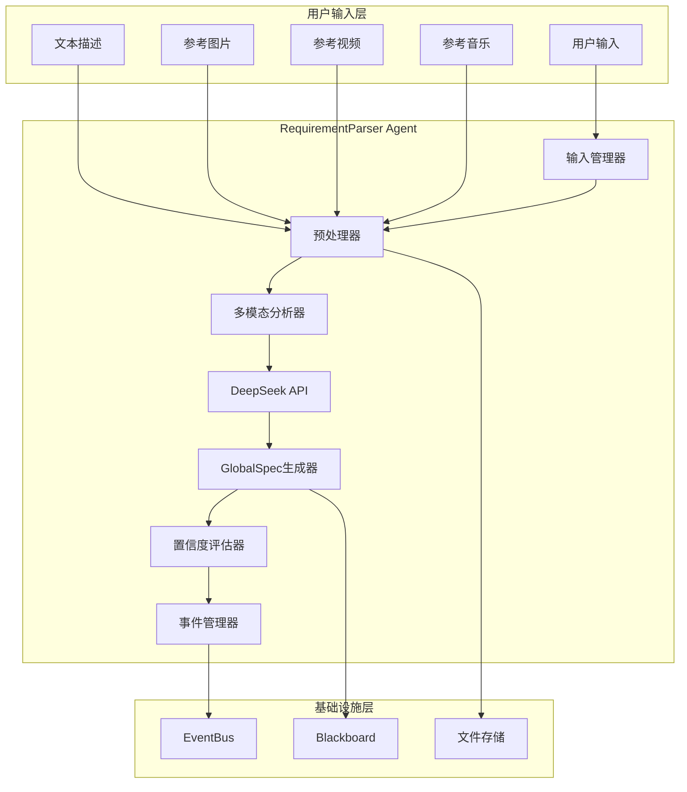
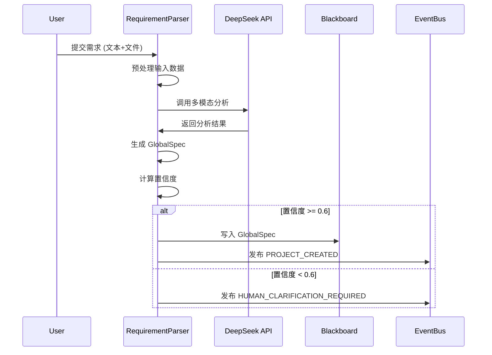

# Design Document

## Overview

RequirementParser Agent 是 LivingAgentPipeline 系统的入口层组件，负责将用户的多模态输入（文本、图片、视频、音频）转换为标准化的 GlobalSpec 数据结构。该 Agent 采用 DeepSeek-V3.2 模型进行智能分析，通过多阶段处理流程确保高质量的需求理解和规格生成。

设计核心理念：
- **多模态融合**: 统一处理文本、图像、视频、音频等不同类型的输入
- **智能推理**: 利用大语言模型的理解能力填补用户输入的信息缺口
- **置信度驱动**: 基于置信度评估决定是否需要人工介入
- **标准化输出**: 生成符合系统契约的 GlobalSpec 数据结构

## Architecture

### 系统架构图



### 数据流架构



## Components and Interfaces

### 1. 输入管理器 (InputManager)

**职责**: 接收和验证用户输入，统一输入格式

```python
class InputManager:
    async def receive_user_input(self, input_data: UserInputData) -> ProcessedInput:
        """接收用户输入并进行初步验证"""
        
    async def validate_files(self, files: List[FileReference]) -> List[ValidatedFile]:
        """验证上传文件的格式和大小"""
        
    async def extract_metadata(self, files: List[ValidatedFile]) -> FileMetadata:
        """提取文件基础元数据"""
```

**输入接口**:
```python
@dataclass
class UserInputData:
    text_description: str
    reference_images: List[str]  # S3 URLs
    reference_videos: List[str]  # S3 URLs  
    reference_audio: List[str]   # S3 URLs
    user_preferences: Dict[str, Any]
    timestamp: str
```

### 2. 预处理器 (Preprocessor)

**职责**: 对输入数据进行预处理，为模型分析做准备

```python
class Preprocessor:
    async def process_text(self, text: str) -> ProcessedText:
        """清理和标准化文本输入"""
        
    async def process_images(self, image_urls: List[str]) -> List[ProcessedImage]:
        """调整图片尺寸，提取基础特征"""
        
    async def process_videos(self, video_urls: List[str]) -> List[ProcessedVideo]:
        """提取关键帧，分析时长和基础信息"""
        
    async def process_audio(self, audio_urls: List[str]) -> List[ProcessedAudio]:
        """提取音频特征，分析时长和基础信息"""
```

### 3. 多模态分析器 (MultimodalAnalyzer)

**职责**: 协调不同模态的分析，整合分析结果

```python
class MultimodalAnalyzer:
    def __init__(self, deepseek_client: DeepSeekClient):
        self.deepseek_client = deepseek_client
        
    async def analyze_text_intent(self, text: ProcessedText) -> TextAnalysis:
        """分析文本意图和关键信息"""
        
    async def analyze_visual_style(self, images: List[ProcessedImage]) -> VisualStyle:
        """分析视觉风格和色彩偏好"""
        
    async def analyze_motion_style(self, videos: List[ProcessedVideo]) -> MotionStyle:
        """分析运镜风格和节奏偏好"""
        
    async def analyze_audio_mood(self, audio: List[ProcessedAudio]) -> AudioMood:
        """分析音频情绪和风格"""
        
    async def synthesize_analysis(self, analyses: List[Analysis]) -> SynthesizedAnalysis:
        """综合所有分析结果"""
```

### 4. DeepSeek API 客户端

**职责**: 封装对 DeepSeek-V3.2 模型的调用

```python
class DeepSeekClient:
    def __init__(self, api_key: str, base_url: str):
        self.api_key = api_key
        self.base_url = base_url
        self.session = aiohttp.ClientSession()
        
    async def chat_completion(
        self,
        messages: List[Dict[str, str]],
        model: str = "DeepSeek-V3.2",
        temperature: float = 0.7,
        max_tokens: int = 2000
    ) -> ChatCompletionResponse:
        """调用聊天完成 API"""
        
    async def analyze_multimodal(
        self,
        text: str,
        images: List[str] = None,
        system_prompt: str = None
    ) -> MultimodalAnalysisResponse:
        """多模态分析接口"""
        
    async def _make_request(self, payload: Dict) -> Dict:
        """底层 HTTP 请求封装"""
        headers = {
            "Authorization": f"Bearer {self.api_key}",
            "Content-Type": "application/json"
        }
        
        async with self.session.post(
            f"{self.base_url}/chat/completions",
            json=payload,
            headers=headers,
            timeout=30
        ) as response:
            if response.status != 200:
                raise DeepSeekAPIError(f"API call failed: {response.status}")
            return await response.json()
```

### 5. GlobalSpec 生成器

**职责**: 基于分析结果生成标准化的 GlobalSpec

```python
class GlobalSpecGenerator:
    def __init__(self, default_config: Dict[str, Any]):
        self.default_config = default_config
        
    async def generate_spec(self, analysis: SynthesizedAnalysis) -> GlobalSpec:
        """生成 GlobalSpec"""
        
    def _extract_title(self, text_analysis: TextAnalysis) -> str:
        """提取项目标题"""
        
    def _estimate_duration(self, text_analysis: TextAnalysis) -> int:
        """估算视频时长"""
        
    def _determine_aspect_ratio(self, user_prefs: Dict, visual_style: VisualStyle) -> str:
        """确定宽高比"""
        
    def _extract_characters(self, text_analysis: TextAnalysis) -> List[str]:
        """提取角色列表"""
        
    def _synthesize_style(
        self,
        visual_style: VisualStyle,
        motion_style: MotionStyle,
        audio_mood: AudioMood
    ) -> StyleConfig:
        """综合风格配置"""
```

### 6. 置信度评估器

**职责**: 评估生成结果的可信度，决定是否需要人工介入

```python
class ConfidenceEvaluator:
    def __init__(self, thresholds: Dict[str, float]):
        self.thresholds = thresholds
        
    async def evaluate_confidence(
        self,
        global_spec: GlobalSpec,
        analysis: SynthesizedAnalysis,
        user_input: UserInputData
    ) -> ConfidenceReport:
        """评估整体置信度"""
        
    def _evaluate_text_clarity(self, text: str) -> float:
        """评估文本描述的清晰度"""
        
    def _evaluate_style_consistency(self, style: StyleConfig) -> float:
        """评估风格一致性"""
        
    def _evaluate_completeness(self, global_spec: GlobalSpec) -> float:
        """评估信息完整性"""
        
    def _generate_clarification_requests(
        self,
        low_confidence_areas: List[str]
    ) -> List[ClarificationRequest]:
        """生成澄清请求"""
```

## Data Models

### 核心数据结构

```python
@dataclass
class ProcessedInput:
    """预处理后的输入数据"""
    text: ProcessedText
    images: List[ProcessedImage]
    videos: List[ProcessedVideo]
    audio: List[ProcessedAudio]
    metadata: InputMetadata

@dataclass
class ProcessedText:
    """处理后的文本数据"""
    original: str
    cleaned: str
    language: str
    word_count: int
    key_phrases: List[str]

@dataclass
class ProcessedImage:
    """处理后的图像数据"""
    url: str
    width: int
    height: int
    format: str
    dominant_colors: List[str]
    thumbnail_url: str

@dataclass
class SynthesizedAnalysis:
    """综合分析结果"""
    text_analysis: TextAnalysis
    visual_style: VisualStyle
    motion_style: MotionStyle
    audio_mood: AudioMood
    overall_theme: str
    confidence_scores: Dict[str, float]

@dataclass
class TextAnalysis:
    """文本分析结果"""
    main_theme: str
    characters: List[CharacterInfo]
    scenes: List[SceneInfo]
    mood_tags: List[str]
    estimated_duration: int
    narrative_structure: str

@dataclass
class VisualStyle:
    """视觉风格分析"""
    color_palette: List[str]
    lighting_style: str
    composition_style: str
    art_style: str
    reference_styles: List[str]

@dataclass
class ConfidenceReport:
    """置信度报告"""
    overall_confidence: float
    component_scores: Dict[str, float]
    low_confidence_areas: List[str]
    clarification_requests: List[ClarificationRequest]
    recommendation: str  # "proceed", "clarify", "human_review"
```

### GlobalSpec 映射

```python
def map_to_global_spec(analysis: SynthesizedAnalysis) -> GlobalSpec:
    """将分析结果映射到 GlobalSpec"""
    return GlobalSpec(
        title=analysis.text_analysis.main_theme,
        duration=analysis.text_analysis.estimated_duration,
        aspect_ratio=determine_aspect_ratio(analysis.visual_style),
        quality_tier="balanced",  # 默认值，可配置
        resolution="1080x1920",   # 基于 aspect_ratio 计算
        fps=30,
        style=StyleConfig(
            tone=analysis.visual_style.lighting_style,
            palette=analysis.visual_style.color_palette,
            visual_dna_version=1
        ),
        characters=[char.name for char in analysis.text_analysis.characters],
        mood=",".join(analysis.text_analysis.mood_tags),
        user_options={}
    )
```

## Correctness Properties

*A property is a characteristic or behavior that should hold true across all valid executions of a system-essentially, a formal statement about what the system should do. Properties serve as the bridge between human-readable specifications and machine-verifiable correctness guarantees.*

### Property-Based Testing Overview

Property-based testing (PBT) validates software correctness by testing universal properties across many generated inputs. Each property is a formal specification that should hold for all valid inputs.

### Core Principles

1. **Universal Quantification**: Every property must contain an explicit "for all" statement
2. **Requirements Traceability**: Each property must reference the requirements it validates
3. **Executable Specifications**: Properties must be implementable as automated tests
4. **Comprehensive Coverage**: Properties should cover all testable acceptance criteria

### Correctness Properties

#### Property 1: Multimodal Input Processing
*For any* combination of user inputs (text, images, videos, audio), the RequirementParser should successfully process each modality and extract relevant features without failing on valid input formats
**Validates: Requirements 1.1, 1.2, 1.3, 1.4, 1.5**

#### Property 2: GlobalSpec Structure Completeness
*For any* valid user input, the generated GlobalSpec should contain all required fields (title, duration, aspect_ratio, quality_tier, style configuration, characters, mood) with valid values
**Validates: Requirements 2.1, 2.2, 2.3, 2.4, 2.5**

#### Property 3: API Communication Reliability
*For any* valid API request to DeepSeek, the RequirementParser should use correct authentication headers, handle responses properly, and implement retry logic for transient failures
**Validates: Requirements 3.1, 3.2, 3.3, 3.5**

#### Property 4: Confidence-Based Decision Making
*For any* analysis result, the RequirementParser should calculate a valid confidence score (0-1) and trigger appropriate actions based on confidence thresholds
**Validates: Requirements 4.1, 4.2, 4.3, 4.4, 4.5**

#### Property 5: Event Publishing Consistency
*For any* completed or failed parsing operation, the RequirementParser should publish the appropriate event (PROJECT_CREATED or ERROR_OCCURRED) with complete metadata and causal relationships
**Validates: Requirements 5.1, 5.2, 5.3, 5.4, 5.5**

#### Property 6: Error Recovery and Resilience
*For any* error condition (API failures, invalid inputs, file access issues, resource constraints), the RequirementParser should handle the error gracefully, attempt appropriate recovery strategies, and escalate when necessary
**Validates: Requirements 6.1, 6.2, 6.3, 6.4, 6.5**

#### Property 7: Configuration Management
*For any* deployment environment, the RequirementParser should correctly read configuration from environment variables, validate required settings, and provide clear error messages for invalid configurations
**Validates: Requirements 7.1, 7.2, 7.3, 7.4, 7.5**

#### Property 8: Comprehensive Monitoring and Logging
*For any* operation performed by the RequirementParser, relevant metrics (latency, cost, input size, processing time, confidence scores, error types) should be recorded in structured logs
**Validates: Requirements 8.1, 8.2, 8.3, 8.4, 8.5**

## Error Handling

### 三层错误恢复策略

#### Level 1: Agent 自动重试（90% 场景）

**触发条件**:
- DeepSeek API 临时错误（429, 500, 503）
- 网络超时
- 文件下载失败

**处理策略**:
```python
async def retry_with_exponential_backoff(
    func: Callable,
    max_retries: int = 3,
    initial_delay: float = 1.0,
    backoff_factor: float = 2.0
) -> Any:
    """指数退避重试机制"""
    delay = initial_delay
    
    for attempt in range(max_retries):
        try:
            return await func()
        except (APITimeoutError, APIRateLimitError, NetworkError) as e:
            if attempt == max_retries - 1:
                raise
            
            logger.warning(f"Attempt {attempt + 1} failed: {e}. Retrying in {delay}s...")
            await asyncio.sleep(delay)
            delay *= backoff_factor
    
    raise MaxRetriesExceededError(f"Failed after {max_retries} attempts")
```

#### Level 2: 降级策略（9% 场景）

**触发条件**:
- Level 1 重试失败
- 部分输入文件无法处理
- API 配额不足

**处理策略**:
```python
async def fallback_processing(user_input: UserInputData) -> GlobalSpec:
    """降级处理策略"""
    try:
        # 尝试完整处理
        return await full_processing(user_input)
    except Exception as e:
        logger.warning(f"Full processing failed: {e}. Attempting fallback...")
        
        # 策略1: 仅处理文本输入
        if user_input.text_description:
            return await text_only_processing(user_input.text_description)
        
        # 策略2: 使用默认模板
        return await template_based_processing(user_input)
```

#### Level 3: 人工介入（1% 场景）

**触发条件**:
- Level 2 降级失败
- 置信度极低（< 0.3）
- 用户输入完全无法理解

**处理流程**:
```python
async def escalate_to_human(
    user_input: UserInputData,
    error_context: ErrorContext
) -> None:
    """升级到人工处理"""
    
    # 创建人工审核请求
    human_review_request = HumanReviewRequest(
        request_id=generate_id(),
        user_input=user_input,
        error_details=error_context,
        suggested_actions=[
            "Review user input for clarity",
            "Provide additional context",
            "Use manual GlobalSpec creation"
        ],
        priority="high" if error_context.is_critical else "normal"
    )
    
    # 发布人工介入事件
    await self.event_bus.publish(Event(
        event_type=EventType.HUMAN_GATE_TRIGGERED,
        payload=human_review_request.dict()
    ))
```

### 错误分类和处理

| 错误类型 | 处理策略 | 示例 |
|---------|---------|------|
| **输入验证错误** | 立即返回错误信息 | 文件格式不支持、文本为空 |
| **API 调用错误** | 重试 + 降级 | 超时、限流、服务不可用 |
| **资源不足错误** | 分批处理 + 降级 | 内存不足、磁盘空间不足 |
| **业务逻辑错误** | 记录 + 人工介入 | 无法理解用户意图 |
| **系统错误** | 记录 + 重启 | 数据库连接失败 |

## Testing Strategy

### 测试层次架构

#### 1. 单元测试（Unit Tests）

**测试范围**: 各组件的核心逻辑

**关键测试用例**:
```python
# 测试文本分析
def test_text_analysis_extraction():
    """测试从文本中提取关键信息"""
    text = "一个年轻的探险家在神秘的森林中寻找宝藏，时长30秒"
    analyzer = TextAnalyzer()
    
    result = analyzer.analyze(text)
    
    assert "探险家" in result.characters
    assert result.estimated_duration == 30
    assert "神秘" in result.mood_tags

# 测试置信度计算
def test_confidence_calculation():
    """测试置信度计算的准确性"""
    evaluator = ConfidenceEvaluator()
    
    # 高质量输入应该有高置信度
    high_quality_spec = create_complete_global_spec()
    confidence = evaluator.evaluate_confidence(high_quality_spec)
    assert confidence.overall_confidence > 0.8
    
    # 低质量输入应该有低置信度
    low_quality_spec = create_incomplete_global_spec()
    confidence = evaluator.evaluate_confidence(low_quality_spec)
    assert confidence.overall_confidence < 0.6
```

#### 2. 集成测试（Integration Tests）

**测试范围**: 组件间协作和外部服务集成

**关键测试用例**:
```python
@pytest.mark.integration
async def test_end_to_end_processing():
    """测试完整的需求解析流程"""
    # 准备测试数据
    user_input = UserInputData(
        text_description="一个温馨的家庭聚餐场景",
        reference_images=["test_image.jpg"],
        reference_videos=[],
        reference_audio=[]
    )
    
    # 执行解析
    parser = RequirementParser()
    result = await parser.process_user_input(user_input)
    
    # 验证结果
    assert result.global_spec is not None
    assert result.confidence_report.overall_confidence > 0.0
    assert result.events_published > 0

@pytest.mark.integration
async def test_deepseek_api_integration():
    """测试 DeepSeek API 集成"""
    client = DeepSeekClient(api_key="test_key", base_url="test_url")
    
    # Mock API 响应
    with patch('aiohttp.ClientSession.post') as mock_post:
        mock_response = AsyncMock()
        mock_response.status = 200
        mock_response.json.return_value = {
            "choices": [{"message": {"content": "test response"}}]
        }
        mock_post.return_value.__aenter__.return_value = mock_response
        
        result = await client.chat_completion([
            {"role": "user", "content": "test message"}
        ])
        
        assert result is not None
        mock_post.assert_called_once()
```

#### 3. 属性测试（Property Tests）

**测试配置**: 每个属性测试运行最少 100 次迭代

**关键属性测试**:
```python
from hypothesis import given, strategies as st

@given(st.text(min_size=10, max_size=1000))
def test_text_processing_robustness(text_input):
    """属性测试：文本处理的鲁棒性
    
    Feature: requirement-parser-agent, Property 1: Multimodal Input Processing
    """
    processor = TextProcessor()
    
    # 任何有效文本输入都应该能被处理
    result = processor.process_text(text_input)
    
    assert result is not None
    assert result.cleaned is not None
    assert len(result.cleaned) <= len(text_input)  # 清理后不应该更长

@given(st.dictionaries(
    keys=st.sampled_from(['text_description', 'reference_images', 'reference_videos']),
    values=st.one_of(st.text(), st.lists(st.text()))
))
def test_global_spec_generation_completeness(user_input_dict):
    """属性测试：GlobalSpec 生成的完整性
    
    Feature: requirement-parser-agent, Property 2: GlobalSpec Structure Completeness
    """
    generator = GlobalSpecGenerator()
    
    # 任何用户输入都应该生成完整的 GlobalSpec
    global_spec = generator.generate_spec(user_input_dict)
    
    # 验证必需字段存在
    assert hasattr(global_spec, 'title')
    assert hasattr(global_spec, 'duration')
    assert hasattr(global_spec, 'aspect_ratio')
    assert hasattr(global_spec, 'quality_tier')
    assert global_spec.duration > 0

@given(st.floats(min_value=0.0, max_value=1.0))
def test_confidence_based_decisions(confidence_score):
    """属性测试：基于置信度的决策
    
    Feature: requirement-parser-agent, Property 4: Confidence-Based Decision Making
    """
    evaluator = ConfidenceEvaluator()
    
    decision = evaluator.make_decision(confidence_score)
    
    if confidence_score >= 0.6:
        assert decision.action == "proceed"
    else:
        assert decision.action in ["clarify", "human_review"]
```

#### 4. 性能测试（Performance Tests）

**性能目标**:
- 文本解析延迟 < 2 秒
- 图片分析延迟 < 5 秒
- 完整解析流程 < 30 秒
- API 调用成功率 > 95%

```python
@pytest.mark.performance
async def test_processing_latency():
    """测试处理延迟"""
    parser = RequirementParser()
    user_input = create_standard_test_input()
    
    start_time = time.time()
    result = await parser.process_user_input(user_input)
    end_time = time.time()
    
    processing_time = end_time - start_time
    assert processing_time < 30.0  # 30秒内完成

@pytest.mark.performance
async def test_concurrent_processing():
    """测试并发处理能力"""
    parser = RequirementParser()
    inputs = [create_test_input() for _ in range(10)]
    
    start_time = time.time()
    results = await asyncio.gather(*[
        parser.process_user_input(inp) for inp in inputs
    ])
    end_time = time.time()
    
    # 并发处理不应该比串行慢太多
    assert end_time - start_time < 60.0
    assert all(r.global_spec is not None for r in results)
```

### 测试数据管理

```python
# 测试数据生成器
class TestDataGenerator:
    @staticmethod
    def create_text_samples() -> List[str]:
        """创建多样化的文本测试样本"""
        return [
            "一个年轻的探险家在神秘森林中寻找宝藏",
            "温馨的家庭聚餐，充满欢声笑语",
            "科幻未来城市，霓虹灯闪烁",
            "宁静的乡村田园风光",
            "激烈的体育比赛现场"
        ]
    
    @staticmethod
    def create_image_samples() -> List[str]:
        """创建测试图片样本"""
        return [
            "test_images/landscape.jpg",
            "test_images/portrait.jpg", 
            "test_images/abstract.jpg"
        ]
    
    @staticmethod
    def create_invalid_inputs() -> List[Dict]:
        """创建无效输入测试样本"""
        return [
            {"text_description": ""},  # 空文本
            {"reference_images": ["invalid_url"]},  # 无效URL
            {},  # 完全空输入
        ]
```

### 测试环境配置

```python
# pytest.ini
[tool:pytest]
testpaths = tests
python_files = test_*.py
python_classes = Test*
python_functions = test_*
addopts = 
    --strict-markers
    --disable-warnings
    --cov=src
    --cov-report=html
    --cov-report=term-missing
    --cov-fail-under=80

markers =
    unit: Unit tests
    integration: Integration tests  
    performance: Performance tests
    property: Property-based tests
```

### 持续集成测试

```yaml
# .github/workflows/test.yml
name: Test Suite
on: [push, pull_request]

jobs:
  test:
    runs-on: ubuntu-latest
    steps:
      - uses: actions/checkout@v2
      - name: Set up Python
        uses: actions/setup-python@v2
        with:
          python-version: 3.9
      
      - name: Install dependencies
        run: |
          pip install -r requirements.txt
          pip install -r requirements-test.txt
      
      - name: Run unit tests
        run: pytest tests/unit -v
      
      - name: Run integration tests
        run: pytest tests/integration -v
        env:
          DEEPSEEK_API_KEY: ${{ secrets.DEEPSEEK_API_KEY }}
      
      - name: Run property tests
        run: pytest tests/property -v --hypothesis-show-statistics
      
      - name: Upload coverage
        uses: codecov/codecov-action@v1
```