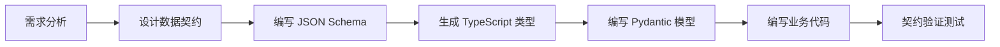
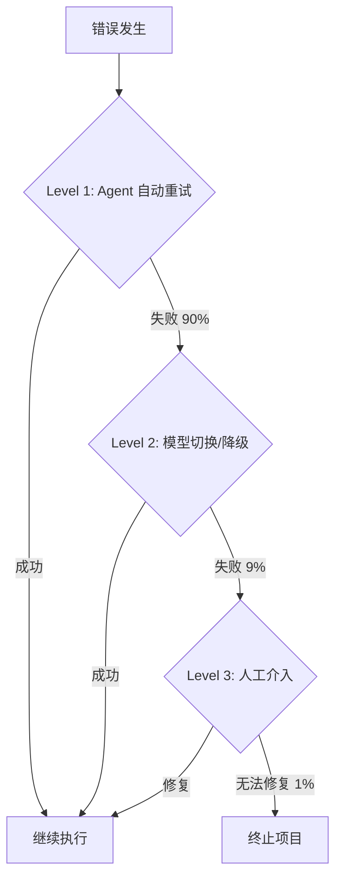

# LivingAgentPipeline 开发规范

> **版本**: 1.0  
> **更新日期**: 2025-12-26  
> **适用范围**: 所有开发团队成员

---

## 📋 目录

1. [契约优先开发流程](#1-契约优先开发流程)
2. [Agent 开发规范](#2-agent-开发规范)
3. [代码风格和质量标准](#3-代码风格和质量标准)
4. [测试规范](#4-测试规范)
5. [事件驱动开发指南](#5-事件驱动开发指南)
6. [数据模型规范](#6-数据模型规范)
7. [错误处理和日志规范](#7-错误处理和日志规范)
8. [性能和成本优化](#8-性能和成本优化)
9. [版本控制和协作](#9-版本控制和协作)

---

## 1. 契约优先开发流程

### 1.1 核心原则

> [!IMPORTANT]
> **契约即真理**：所有数据结构、API 接口、事件格式必须先在 `contracts/` 目录中定义，然后才能编写代码。

### 1.2 契约定义工作流



#### 步骤详解

**Step 1: 设计数据契约**
- 明确数据结构的必需字段和可选字段
- 定义枚举类型和验证规则
- 考虑向后兼容性

**Step 2: 编写 JSON Schema**
```json
{
  "$schema": "https://json-schema.org/draft/2020-12/schema",
  "$id": "contracts/0_shared/your_model.schema.json",
  "title": "YourModel",
  "type": "object",
  "properties": {
    "field_name": {
      "type": "string",
      "description": "字段说明"
    }
  },
  "required": ["field_name"]
}
```

**Step 3: 生成 TypeScript 类型**
```bash
cd contracts
npm run generate-types
```

**Step 4: 编写 Pydantic 模型**
```python
from pydantic import BaseModel, Field

class YourModel(BaseModel):
    """模型说明"""
    field_name: str = Field(..., description="字段说明")
    
    class Config:
        extra = "forbid"  # 禁止额外字段
```

### 1.3 契约版本管理

| 变更类型 | 处理方式 | 示例 |
|---------|---------|------|
| 新增可选字段 | 向后兼容，直接添加 | 添加 `metadata?: object` |
| 新增必需字段 | **破坏性变更**，需要版本升级 | 添加 `version: number` |
| 修改字段类型 | **破坏性变更**，需要版本升级 | `string` → `number` |
| 删除字段 | **破坏性变更**，需要版本升级 | 删除 `deprecated_field` |

> [!WARNING]
> 破坏性变更必须：
> 1. 更新契约版本号
> 2. 在变更日志中记录
> 3. 通知所有相关团队成员
> 4. 提供迁移指南

---

## 2. Agent 开发规范

### 2.1 Agent 目录结构

```
src/agents/your_agent/
├── __init__.py           # 导出 Agent 类
├── agent.py              # Agent 主实现
├── config.py             # 配置管理（Pydantic Settings）
├── README.md             # Agent 文档
└── tests/
    └── test_agent.py     # 单元测试
```

### 2.2 Agent 基础实现模板

```python
"""
YourAgent - 简要说明

职责:
- 职责1
- 职责2
"""

import logging
from typing import List
from src.infrastructure.event_bus import EventSubscriber, Event, EventType

logger = logging.getLogger(__name__)


class YourAgent(EventSubscriber):
    """Agent 详细说明"""
    
    def __init__(self, name: str = "YourAgent"):
        super().__init__(name)
        self.subscribe_to([
            EventType.YOUR_EVENT_TYPE,
        ])
    
    async def handle_event(self, event: Event) -> None:
        """
        处理订阅的事件
        
        Args:
            event: 接收到的事件
        """
        logger.info(f"{self.name} received event: {event.event_type}")
        
        try:
            # 事件路由
            if event.event_type == EventType.YOUR_EVENT_TYPE:
                await self._handle_your_event(event)
        except Exception as e:
            logger.error(f"Error handling event: {e}", exc_info=True)
            # 发布错误事件
            await self._publish_error_event(event, e)
    
    async def _handle_your_event(self, event: Event) -> None:
        """处理特定事件的私有方法"""
        # 1. 从 Blackboard 读取数据
        data = await self._read_from_blackboard(event.project_id)
        
        # 2. 执行业务逻辑
        result = await self._process_data(data)
        
        # 3. 写回 Blackboard
        await self._write_to_blackboard(event.project_id, result)
        
        # 4. 发布完成事件
        await self._publish_completion_event(event, result)
    
    async def _read_from_blackboard(self, project_id: str) -> dict:
        """从 Blackboard 读取数据"""
        # 实现细节
        pass
    
    async def _write_to_blackboard(self, project_id: str, data: dict) -> None:
        """写入数据到 Blackboard"""
        # 实现细节
        pass
    
    async def _publish_completion_event(self, trigger_event: Event, result: dict) -> None:
        """发布完成事件"""
        # 实现细节
        pass
    
    async def _publish_error_event(self, trigger_event: Event, error: Exception) -> None:
        """发布错误事件"""
        # 实现细节
        pass
```

### 2.3 Agent 接口规范

#### 必须实现的方法

| 方法 | 说明 | 必需 |
|-----|------|-----|
| `__init__()` | 初始化并订阅事件 | ✅ |
| `handle_event()` | 处理事件的入口方法 | ✅ |

#### 推荐的私有方法

| 方法模式 | 说明 | 示例 |
|---------|------|------|
| `_handle_xxx_event()` | 处理特定类型事件 | `_handle_image_generated()` |
| `_read_from_blackboard()` | 读取共享数据 | 读取 Shot 数据 |
| `_write_to_blackboard()` | 写入共享数据 | 更新 DNA Bank |
| `_publish_xxx_event()` | 发布事件 | `_publish_keyframe_ready()` |
| `_call_external_api()` | 调用外部服务 | 调用图像生成 API |

### 2.4 Event 订阅规范

```python
# ✅ 正确：明确订阅需要的事件
self.subscribe_to([
    EventType.SCRIPT_WRITTEN,
    EventType.KEYFRAME_REQUESTED,
])

# ❌ 错误：订阅所有事件
self.subscribe_to(list(EventType))

# ❌ 错误：订阅不相关的事件
self.subscribe_to([EventType.VIDEO_GENERATED])  # 如果 Agent 不处理视频
```

### 2.5 Blackboard 数据访问规范

```python
# ✅ 正确：使用 RPC 调用访问 Blackboard
from src.contracts import create_blackboard_request

request = create_blackboard_request(
    request_id=generate_id(),
    method="get_project",
    params={"project_id": project_id}
)
response = await blackboard_client.call(request.dict())

# ❌ 错误：直接访问数据库
# project = db.query("SELECT * FROM projects WHERE id=?", project_id)

# ❌ 错误：Agent 间直接通信
# result = await other_agent.get_data()
```

---

## 3. 代码风格和质量标准

### 3.1 Python 代码风格

基于 **PEP 8** + **Black** + **项目约定**

#### 格式化工具

```bash
# 自动格式化
black src/ tests/ --line-length 100

# 检查代码风格
flake8 src/ tests/ --max-line-length 100

# 类型检查
mypy src/ --strict
```

#### 代码风格要点

```python
# ✅ 正确示例
from typing import Dict, List, Optional
import logging

logger = logging.getLogger(__name__)


class MyAgent:
    """简要说明
    
    详细说明可以写在这里
    """
    
    def __init__(self, name: str, config: Optional[dict] = None) -> None:
        self.name = name
        self.config = config or {}
    
    async def process_data(
        self,
        data: Dict[str, any],
        options: Optional[List[str]] = None
    ) -> Dict[str, any]:
        """
        处理数据
        
        Args:
            data: 输入数据
            options: 可选参数列表
            
        Returns:
            处理后的数据
            
        Raises:
            ValueError: 当数据格式无效时
        """
        if not data:
            raise ValueError("Data cannot be empty")
        
        result = self._transform(data)
        return result


# ❌ 错误示例
class myagent:  # 类名应该用 PascalCase
    def process(self,data,options):  # 缺少类型注解和空格
        result=self._transform(data)  # 缺少空格
        return result  # 缺少文档字符串
```

### 3.2 类型注解要求

> [!IMPORTANT]
> **100% 类型提示覆盖率**是强制要求

```python
# ✅ 完整的类型注解
from typing import Dict, List, Optional, Union, Callable
from datetime import datetime

def process_events(
    events: List[Event],
    filter_fn: Optional[Callable[[Event], bool]] = None,
    metadata: Optional[Dict[str, any]] = None
) -> Dict[str, Union[int, List[str]]]:
    """处理事件列表"""
    pass

# ✅ 类属性类型注解
class Agent:
    name: str
    subscribed_events: List[EventType]
    metadata: Dict[str, any]
    
    def __init__(self, name: str) -> None:
        self.name = name
        self.subscribed_events = []
        self.metadata = {}

# ❌ 缺少类型注解（不允许）
def process(data):  # 缺少参数和返回值类型
    return data
```

### 3.3 文档字符串标准

使用 **Google Style Docstrings**

```python
def complex_function(
    param1: str,
    param2: int,
    param3: Optional[Dict[str, any]] = None
) -> List[str]:
    """
    函数的简要说明（一句话）
    
    详细说明可以写多段，解释函数的作用、算法、注意事项等。
    第二段可以继续详细说明。
    
    Args:
        param1: 第一个参数的说明
        param2: 第二个参数的说明
        param3: 第三个参数的说明（可选）
            可以多行说明
    
    Returns:
        返回值的说明
        可以多行
    
    Raises:
        ValueError: 当 param2 小于 0 时
        KeyError: 当 param3 缺少必需的键时
    
    Example:
        >>> result = complex_function("test", 42)
        >>> print(result)
        ['item1', 'item2']
    """
    pass
```

### 3.4 命名约定

| 类型 | 约定 | 示例 |
|-----|------|------|
| 类名 | PascalCase | `ImageGeneratorAgent` |
| 函数/方法 | snake_case | `generate_keyframe()` |
| 私有方法 | `_snake_case` | `_validate_prompt()` |
| 常量 | UPPER_SNAKE_CASE | `MAX_RETRY_COUNT` |
| 变量 | snake_case | `project_id`, `event_type` |
| 模块 | snake_case | `event_bus.py` |
| 包 | snake_case | `infrastructure/` |

```python
# ✅ 正确的命名
MAX_RETRY_COUNT = 3
DEFAULT_TIMEOUT = 30

class ImageGeneratorAgent(EventSubscriber):
    def __init__(self, name: str) -> None:
        self.agent_name = name
        self._retry_count = 0
    
    async def generate_image(self, prompt: str) -> str:
        """公有方法"""
        validated_prompt = self._validate_prompt(prompt)
        return await self._call_api(validated_prompt)
    
    def _validate_prompt(self, prompt: str) -> str:
        """私有方法"""
        return prompt.strip()

# ❌ 错误的命名
maxRetryCount = 3  # 应该是 UPPER_SNAKE_CASE
class imageGenerator:  # 应该是 PascalCase
    def GenerateImage(self):  # 应该是 snake_case
        pass
```

---

## 4. 测试规范

### 4.1 测试覆盖率目标

| 类型 | 最低要求 | 推荐目标 |
|-----|---------|---------|
| 单元测试覆盖率 | 80% | 90%+ |
| 集成测试覆盖率 | 60% | 75%+ |
| 关键路径覆盖率 | 100% | 100% |

### 4.2 测试文件组织

```
tests/
├── unit/                    # 单元测试
│   ├── agents/
│   │   └── test_your_agent.py
│   └── infrastructure/
│       └── test_event_bus.py
├── integration/             # 集成测试
│   └── test_agent_collaboration.py
└── e2e/                     # 端到端测试
    └── test_full_pipeline.py
```

### 4.3 单元测试模板

```python
"""
YourAgent 单元测试
"""

import pytest
from unittest.mock import AsyncMock, Mock, patch
from src.agents.your_agent import YourAgent
from src.infrastructure.event_bus import Event, EventType


@pytest.fixture
def agent():
    """创建 Agent 实例"""
    return YourAgent(name="TestAgent")


@pytest.fixture
def sample_event():
    """创建测试事件"""
    return Event(
        event_id="evt_001",
        project_id="proj_001",
        event_type=EventType.YOUR_EVENT_TYPE,
        actor="TestActor",
        payload={"test": "data"},
        timestamp="2025-12-26T12:00:00Z"
    )


class TestYourAgent:
    """YourAgent 测试套件"""
    
    @pytest.mark.asyncio
    async def test_handle_event_success(self, agent, sample_event):
        """测试：成功处理事件"""
        # Arrange
        agent._read_from_blackboard = AsyncMock(return_value={"data": "test"})
        agent._write_to_blackboard = AsyncMock()
        agent._publish_completion_event = AsyncMock()
        
        # Act
        await agent.handle_event(sample_event)
        
        # Assert
        agent._read_from_blackboard.assert_called_once()
        agent._write_to_blackboard.assert_called_once()
        agent._publish_completion_event.assert_called_once()
    
    @pytest.mark.asyncio
    async def test_handle_event_error(self, agent, sample_event):
        """测试：处理事件时发生错误"""
        # Arrange
        agent._read_from_blackboard = AsyncMock(side_effect=Exception("Test error"))
        agent._publish_error_event = AsyncMock()
        
        # Act
        await agent.handle_event(sample_event)
        
        # Assert
        agent._publish_error_event.assert_called_once()
    
    def test_subscription(self, agent):
        """测试：Agent 订阅了正确的事件"""
        assert EventType.YOUR_EVENT_TYPE in agent.subscribed_events
        assert len(agent.subscribed_events) > 0
```

### 4.4 测试最佳实践

#### AAA 模式（Arrange-Act-Assert）

```python
@pytest.mark.asyncio
async def test_example():
    # Arrange - 准备测试数据和依赖
    agent = YourAgent()
    event = create_test_event()
    
    # Act - 执行被测试的操作
    result = await agent.handle_event(event)
    
    # Assert - 验证结果
    assert result is not None
    assert result.status == "success"
```

#### Mock 外部依赖

```python
# ✅ 正确：Mock 外部 API 调用
@patch('src.agents.your_agent.external_api_call')
async def test_with_mocked_api(mock_api):
    mock_api.return_value = {"result": "success"}
    
    agent = YourAgent()
    result = await agent.process()
    
    assert result == {"result": "success"}
    mock_api.assert_called_once()

# ❌ 错误：直接调用外部 API（测试会很慢且不稳定）
async def test_without_mock():
    agent = YourAgent()
    result = await agent.process()  # 会真实调用 API
```

#### 参数化测试

```python
@pytest.mark.parametrize("input_data,expected", [
    ({"value": 10}, 20),
    ({"value": 5}, 10),
    ({"value": 0}, 0),
])
def test_calculation(input_data, expected):
    result = calculate(input_data)
    assert result == expected
```

---

## 5. 事件驱动开发指南

### 5.1 Event vs Task 区分

| 特性 | Event（事件） | Task（任务） |
|-----|-------------|------------|
| **含义** | 某事已经发生 | 需要做某事 |
| **发送者** | Agent（完成工作后） | Orchestrator（分配工作） |
| **接收者** | 所有订阅的 Agent | 特定的单个 Agent |
| **持久化** | Redis Streams | PostgreSQL |
| **命名** | 过去式：`IMAGE_GENERATED` | 动词：`GENERATE_IMAGE` |
| **示例** | `KEYFRAME_GENERATED` | `GENERATE_KEYFRAME` |

### 5.2 Event 设计原则

#### 命名规范

```python
# ✅ 正确：过去式，表示已发生
EventType.SCRIPT_WRITTEN
EventType.IMAGE_GENERATED
EventType.QA_COMPLETED

# ❌ 错误：动词原型
EventType.WRITE_SCRIPT
EventType.GENERATE_IMAGE
```

#### Event 结构规范

```python
from src.contracts import create_event, EventType, Money

# ✅ 完整的 Event
event = create_event(
    event_id=generate_id(),
    project_id="proj_001",
    event_type=EventType.KEYFRAME_GENERATED,
    actor="ImageGeneratorAgent",  # 谁发布的事件
    payload={                      # 事件数据
        "shot_id": "S01",
        "keyframe_url": "s3://bucket/keyframe.png"
    },
    causation_id=trigger_event_id,  # 因果链
    blackboard_pointer="/projects/proj_001/shots/S01",  # 数据位置
    cost=Money(amount=0.05, currency="USD"),  # 成本
    latency_ms=1500,               # 延迟
    metadata={                     # 额外元数据
        "model": "SDXL-1.0",
        "resolution": "1024x1024"
    }
)
```

### 5.3 Task 设计原则

#### 命名规范

```python
# ✅ 正确：动词原型
TaskType.GENERATE_KEYFRAME
TaskType.RUN_VISUAL_QA
TaskType.WRITE_SCRIPT

# ❌ 错误：过去式
TaskType.KEYFRAME_GENERATED
```

#### Task 结构规范

```python
from src.contracts import create_task, TaskType, Money

# ✅ 完整的 Task
task = create_task(
    task_id=generate_id(),
    task_type=TaskType.GENERATE_KEYFRAME,
    assigned_to="ImageGeneratorAgent",  # 分配给谁
    input_data={                        # 输入数据
        "shot_id": "S01",
        "prompt": "探险家走进森林",
        "style": "cinematic"
    },
    priority=4,                         # 优先级（1-5）
    dependencies=["task_002"],          # 依赖的任务
    estimated_cost=Money(amount=0.10, currency="USD"),
    causation_event_id=event.event_id,  # 触发任务的事件
    metadata={
        "retry_count": 0,
        "deadline": "2025-12-26T15:00:00Z"
    }
)
```

### 5.4 因果链追踪

#### 为什么需要因果链？

- 调试：追踪问题的根源事件
- 成本核算：计算整条链的总成本
- 审计：理解系统的决策过程

#### 如何实现因果链

```python
# Event 1: 用户提交需求
event1 = create_event(
    event_id="evt_001",
    event_type=EventType.REQUIREMENT_SUBMITTED,
    causation_id=None,  # 起点，没有前因
    # ...
)

# Event 2: 剧本生成完成（由 Event 1 触发）
event2 = create_event(
    event_id="evt_002",
    event_type=EventType.SCRIPT_WRITTEN,
    causation_id="evt_001",  # 链接到 Event 1
    # ...
)

# Event 3: 关键帧生成完成（由 Event 2 触发）
event3 = create_event(
    event_id="evt_003",
    event_type=EventType.KEYFRAME_GENERATED,
    causation_id="evt_002",  # 链接到 Event 2
    # ...
)

# 查询因果链
chain = await event_bus.get_causation_chain("evt_003")
# 返回: [evt_001, evt_002, evt_003]
```

### 5.5 事件发布最佳实践

```python
# ✅ 正确：发布事件后立即返回
async def handle_task(self, task: Task) -> None:
    # 执行任务
    result = await self._process_task(task)
    
    # 发布完成事件
    event = create_event(...)
    await self.event_bus.publish(event)
    
    # 立即返回，不等待后续处理
    return

# ❌ 错误：等待其他 Agent 的响应
async def handle_task(self, task: Task) -> None:
    result = await self._process_task(task)
    
    event = create_event(...)
    await self.event_bus.publish(event)
    
    # ❌ 不要这样做！
    response = await self._wait_for_response()
```

---

## 6. 数据模型规范

### 6.1 Project 数据结构

```python
from typing import Dict
from src.contracts import Project, GlobalSpec, Budget, DNAEntry, Shot, Task

# Project 是所有数据的根节点
project = Project(
    project_id="proj_001",
    version=1,
    status="in_progress",
    created_at="2025-12-26T12:00:00Z",
    updated_at="2025-12-26T12:30:00Z",
    globalSpec=GlobalSpec(...),      # 全局需求
    budget=Budget(...),               # 预算信息
    dna_bank={                        # DNA 特征库
        "C1_hero": DNAEntry(...),
        "C2_villain": DNAEntry(...),
    },
    shots={                           # 所有镜头
        "S01": Shot(...),
        "S02": Shot(...),
    },
    tasks={                           # 所有任务
        "task_001": Task(...),
    },
    locks={},                         # 锁信息
    artifact_index={},                # Artifact 索引
    error_log=[],                     # 错误日志
    change_log=[],                    # 变更日志
)
```

### 6.2 Shot 数据结构

```python
from src.contracts import Shot, VoiceLine, AudioStrategy, QAResults

shot = Shot(
    shot_id="S01",
    status="rendering",
    duration=5.0,  # 秒
    script={
        "description": "探险家走进森林",
        "mood_tags": ["mysterious", "adventurous"],
        "voice_lines": [
            VoiceLine(
                speaker="C1_hero",
                text="这里太安静了...",
                start_time=1.5,
                end_time=3.0
            )
        ]
    },
    keyframes={
        "start": "s3://bucket/S01_keyframe_start.png",
        "mid": "s3://bucket/S01_keyframe_mid.png",
        "end": "s3://bucket/S01_keyframe_end.png"
    },
    preview_video="s3://bucket/S01_preview.mp4",
    final_video="s3://bucket/S01_final.mp4",
    audio={
        "strategy": AudioStrategy.EXTERNAL_FULL,
        "music": "s3://bucket/S01_music.wav",
        "voice": "s3://bucket/S01_voice.wav"
    },
    qa_results=QAResults(...)
)
```

### 6.3 DNA Bank 管理

#### DNA Bank 的作用

保存角色、场景、道具的视觉特征（embeddings），确保全片一致性。

#### DNA Entry 结构

```python
from src.contracts import DNAEntry, DNAEmbedding

dna_entry = DNAEntry(
    entity_id="C1_hero",
    entity_type="character",
    embeddings=[
        DNAEmbedding(
            version=1,
            model="CLIP-ViT-L",
            vector=[0.1, 0.2, ...],  # 512 维向量
            weight=0.3,
            confidence=0.88,
            source_artifact="s3://bucket/keyframe_001.png"
        ),
        DNAEmbedding(
            version=2,
            model="CLIP-ViT-L",
            vector=[0.15, 0.22, ...],
            weight=0.5,
            confidence=0.94,
            source_artifact="s3://bucket/keyframe_005.png"
        )
    ],
    merge_strategy="weighted_average",  # 或 "latest_priority"
    metadata={
        "character_name": "探险家",
        "description": "年轻的探险家"
    }
)
```

#### DNA 更新策略

```python
# ✅ 渐进式更新：每生成一个关键帧，更新 DNA
async def update_dna_after_keyframe(
    project_id: str,
    entity_id: str,
    new_embedding: DNAEmbedding
) -> None:
    # 读取现有 DNA
    dna = await blackboard.get_dna_entry(project_id, entity_id)
    
    # 添加新版本
    dna.embeddings.append(new_embedding)
    
    # 如果版本过多，保留最新的 3 个
    if len(dna.embeddings) > 3:
        dna.embeddings = sorted(
            dna.embeddings,
            key=lambda e: e.confidence,
            reverse=True
        )[:3]
    
    # 写回 Blackboard
    await blackboard.update_dna_entry(project_id, entity_id, dna)
```

### 6.4 Artifact 管理

```python
from src.contracts import ArtifactMetadata

# Artifact = 生成的文件（图片、视频、音频等）
artifact = ArtifactMetadata(
    artifact_id="art_001",
    artifact_type="image",  # image, video, audio
    s3_uri="s3://bucket/keyframe_001.png",
    size_bytes=1024000,
    mime_type="image/png",
    created_at="2025-12-26T12:00:00Z",
    created_by="ImageGeneratorAgent",
    metadata={
        "resolution": "1024x1024",
        "model": "SDXL-1.0",
        "prompt": "探险家走进森林"
    }
)

# 索引到 Project
project.artifact_index[artifact.artifact_id] = artifact
```

---

## 7. 错误处理和日志规范

### 7.1 三层错误恢复策略



#### Level 1: Agent 自动重试（90%）

```python
import asyncio
from typing import Optional

async def retry_with_backoff(
    func,
    max_retries: int = 3,
    initial_delay: float = 1.0,
    backoff_factor: float = 2.0
) -> any:
    """
    指数退避重试
    
    Args:
        func: 要重试的异步函数
        max_retries: 最大重试次数
        initial_delay: 初始延迟（秒）
        backoff_factor: 退避因子
    """
    delay = initial_delay
    
    for attempt in range(max_retries):
        try:
            return await func()
        except Exception as e:
            if attempt == max_retries - 1:
                raise
            
            logger.warning(
                f"Attempt {attempt + 1} failed: {e}. "
                f"Retrying in {delay}s..."
            )
            await asyncio.sleep(delay)
            delay *= backoff_factor

# 使用示例
result = await retry_with_backoff(
    lambda: external_api_call(data),
    max_retries=3
)
```

#### Level 2: 模型切换/降级（9%）

```python
async def generate_with_fallback(prompt: str) -> str:
    """尝试多个模型，从高质量到低质量"""
    models = [
        {"name": "SDXL-1.0", "cost": 0.10},
        {"name": "SD-2.1", "cost": 0.05},
        {"name": "SD-1.5", "cost": 0.02},
    ]
    
    for model in models:
        try:
            logger.info(f"Trying model: {model['name']}")
            result = await call_model(model['name'], prompt)
            return result
        except Exception as e:
            logger.warning(f"Model {model['name']} failed: {e}")
            continue
    
    raise Exception("All models failed")
```

#### Level 3: 人工介入（1%）

```python
from src.contracts import create_event, EventType

# 发布需要人工介入的事件
event = create_event(
    event_type=EventType.HUMAN_INTERVENTION_REQUIRED,
    payload={
        "reason": "All auto-retry attempts failed",
        "error_details": str(error),
        "suggested_action": "Manual review required"
    }
)
await event_bus.publish(event)
```

### 7.2 日志规范

#### 日志级别

| 级别 | 使用场景 | 示例 |
|-----|---------|------|
| `DEBUG` | 详细的调试信息 | `logger.debug(f"Prompt: {prompt}")` |
| `INFO` | 正常的流程信息 | `logger.info("Keyframe generated successfully")` |
| `WARNING` | 警告，但可以继续 | `logger.warning("Cost approaching budget limit")` |
| `ERROR` | 错误，但可以恢复 | `logger.error("API call failed, retrying...")` |
| `CRITICAL` | 严重错误，无法恢复 | `logger.critical("Database connection lost")` |

#### 日志格式

```python
import logging

# 配置日志格式
logging.basicConfig(
    level=logging.INFO,
    format="%(asctime)s - %(name)s - %(levelname)s - %(message)s",
    handlers=[
        logging.StreamHandler(),
        logging.FileHandler("app.log")
    ]
)

logger = logging.getLogger(__name__)

# ✅ 正确：结构化日志
logger.info(
    "Event published",
    extra={
        "event_id": event.event_id,
        "event_type": event.event_type,
        "project_id": event.project_id
    }
)

# ✅ 正确：包含上下文
logger.error(
    f"Failed to generate keyframe for shot {shot_id}",
    exc_info=True  # 包含堆栈跟踪
)

# ❌ 错误：信息不足
logger.info("Success")

# ❌ 错误：敏感信息
logger.debug(f"API Key: {api_key}")  # 不要记录密钥！
```

### 7.3 错误追踪

```python
from src.contracts import ErrorEntry

# 记录错误到 Project.error_log
error_entry = ErrorEntry(
    error_id=generate_id(),
    timestamp="2025-12-26T12:00:00Z",
    severity="error",
    source="ImageGeneratorAgent",
    message="Failed to generate keyframe",
    details={
        "shot_id": "S01",
        "error_code": "MODEL_TIMEOUT",
        "retry_count": 3
    },
    causation_event_id=event.event_id,
    resolved=False
)

project.error_log.append(error_entry)
await blackboard.update_project(project)
```

---

## 8. 性能和成本优化

### 8.1 性能指标

| 指标 | 目标值 | 测量方式 |
|-----|--------|---------|
| 单 Shot 生成时间 | < 5 分钟 | 端到端计时 |
| 30 秒视频完整生成 | < 15 分钟 | 端到端计时 |
| Orchestrator 调度延迟 | < 100ms | Event Bus 延迟 |
| Event Bus 吞吐量 | > 1000 events/sec | Redis 监控 |
| Blackboard 读写延迟 | < 50ms | PostgreSQL 慢查询日志 |

### 8.2 成本控制

#### 预算分配

```python
from src.contracts import Budget, Money

budget = Budget(
    total=Money(amount=100.0, currency="USD"),
    spent=Money(amount=25.50, currency="USD"),
    estimated_remaining=Money(amount=30.0, currency="USD"),
    breakdown={
        "image_generation": Money(amount=15.0, currency="USD"),
        "video_generation": Money(amount=8.0, currency="USD"),
        "audio_generation": Money(amount=2.5, currency="USD"),
    }
)
```

#### 实时成本追踪

```python
# ✅ 每个 Event 都记录成本
event = create_event(
    event_type=EventType.IMAGE_GENERATED,
    cost=Money(amount=0.05, currency="USD"),  # 记录成本
    latency_ms=1500,                          # 记录延迟
    # ...
)

# 汇总项目成本
total_cost = sum(
    event.cost.amount
    for event in project_events
    if event.cost
)

# 预算检查
if total_cost > budget.total.amount * 0.8:
    logger.warning(f"Cost approaching budget: {total_cost}/{budget.total.amount}")
```

#### 成本优化策略

```python
# 1. 根据质量档位选择模型
quality_tier = project.globalSpec.quality_tier  # "high", "balanced", "fast"

model_config = {
    "high": {"model": "SDXL-1.0", "cost": 0.10},
    "balanced": {"model": "SD-2.1", "cost": 0.05},
    "fast": {"model": "SD-1.5", "cost": 0.02}
}[quality_tier]

# 2. 批量处理
# ✅ 正确：批量生成关键帧
await generate_keyframes_batch([shot1, shot2, shot3])

# ❌ 错误：逐个生成（成本更高）
for shot in shots:
    await generate_keyframe(shot)

# 3. 缓存重复内容
# 如果多个 Shot 使用相同角色，复用 DNA
if entity_id in project.dna_bank:
    embedding = project.dna_bank[entity_id]
else:
    embedding = await extract_embedding(image)
    project.dna_bank[entity_id] = embedding
```

### 8.3 性能优化

#### 异步并发

```python
import asyncio

# ✅ 正确：并发执行独立任务
async def generate_shot_assets(shot: Shot) -> None:
    # 音乐和配音可以并行生成
    music_task = generate_music(shot)
    voice_task = generate_voice(shot)
    
    # 等待两者完成
    music, voice = await asyncio.gather(music_task, voice_task)
    
    # 混合音频
    final_audio = await mix_audio(music, voice)
    return final_audio

# ❌ 错误：串行执行（慢）
async def generate_shot_assets_slow(shot: Shot) -> None:
    music = await generate_music(shot)
    voice = await generate_voice(shot)
    final_audio = await mix_audio(music, voice)
    return final_audio
```

#### 数据库查询优化

```python
# ✅ 正确：批量查询
shot_ids = ["S01", "S02", "S03"]
shots = await blackboard.get_shots_batch(project_id, shot_ids)

# ❌ 错误：N+1 查询
shots = []
for shot_id in shot_ids:
    shot = await blackboard.get_shot(project_id, shot_id)
    shots.append(shot)
```

---

## 9. 版本控制和协作

### 9.1 Git 工作流

使用 **Git Flow** 变体

```
main
 └── develop
      ├── feature/agent-image-gen
      ├── feature/event-bus-replay
      └── hotfix/bug-123
```

#### 分支命名规范

| 分支类型 | 命名格式 | 示例 |
|---------|---------|------|
| 功能分支 | `feature/<描述>` | `feature/add-music-composer` |
| 修复分支 | `bugfix/<描述>` | `bugfix/fix-event-replay` |
| 热修复 | `hotfix/<描述>` | `hotfix/critical-memory-leak` |
| 发布分支 | `release/v<版本号>` | `release/v1.2.0` |

### 9.2 Commit 消息规范

使用 **Conventional Commits** 格式

```
<type>(<scope>): <subject>

<body>

<footer>
```

#### Type 类型

| Type | 说明 | 示例 |
|------|------|------|
| `feat` | 新功能 | `feat(agent): add ImageGeneratorAgent` |
| `fix` | Bug 修复 | `fix(event-bus): fix event replay bug` |
| `docs` | 文档变更 | `docs(readme): update installation guide` |
| `test` | 测试相关 | `test(agent): add unit tests for YourAgent` |
| `refactor` | 代码重构 | `refactor(blackboard): optimize query performance` |
| `perf` | 性能优化 | `perf(event-bus): improve throughput` |
| `chore` | 构建/工具 | `chore(deps): upgrade pydantic to 2.0` |

#### 示例

```bash
# 好的 commit 消息
git commit -m "feat(agent): implement MusicComposerAgent

- Add MusicComposerAgent class
- Implement mood-based music generation
- Add unit tests with 85% coverage

Closes #42"

# 不好的 commit 消息
git commit -m "update code"
git commit -m "fix bug"
```

### 9.3 Code Review 流程

#### Pull Request 模板

```markdown
## 变更说明
简要描述本次 PR 的目的

## 变更类型
- [ ] 新功能
- [ ] Bug 修复
- [ ] 文档更新
- [ ] 性能优化
- [ ] 代码重构

## 测试情况
- [ ] 单元测试通过
- [ ] 集成测试通过
- [ ] 手动测试完成

## 检查清单
- [ ] 代码符合规范（Black + Flake8）
- [ ] 类型检查通过（mypy）
- [ ] 添加了必要的测试
- [ ] 更新了相关文档
- [ ] 契约变更已记录
- [ ] 性能影响已评估

## 相关 Issue
Closes #123

## 截图/演示
（如果适用）
```

#### Review 检查要点

参见 [CODE_REVIEW_CHECKLIST.md](file:///d:/下载/contracts/CODE_REVIEW_CHECKLIST.md)

### 9.4 协作最佳实践

#### 1. 及时同步

```bash
# 每天开始工作前
git checkout develop
git pull origin develop
git checkout feature/your-feature
git merge develop

# 推送前确保最新
git pull --rebase origin develop
```

#### 2. 小步提交

```bash
# ✅ 正确：小而完整的提交
git add src/agents/your_agent/agent.py
git commit -m "feat(agent): implement basic event handling"

git add tests/test_your_agent.py
git commit -m "test(agent): add event handling tests"

# ❌ 错误：一次提交太多
git add .
git commit -m "implement everything"
```

#### 3. 清晰的 PR 描述

- 说明"为什么"，而不仅仅是"做了什么"
- 包含测试结果截图
- 标注破坏性变更
- 链接相关 Issue

---

## 附录

### A. 开发工具配置

#### VS Code 配置（`.vscode/settings.json`）

```json
{
  "python.linting.enabled": true,
  "python.linting.flake8Enabled": true,
  "python.linting.mypyEnabled": true,
  "python.formatting.provider": "black",
  "python.formatting.blackArgs": ["--line-length", "100"],
  "editor.formatOnSave": true,
  "editor.rulers": [100],
  "[python]": {
    "editor.defaultFormatter": "ms-python.black-formatter",
    "editor.codeActionsOnSave": {
      "source.organizeImports": true
    }
  }
}
```

#### Pre-commit Hook（`.git/hooks/pre-commit`）

```bash
#!/bin/bash
# 自动格式化和检查
black src/ tests/ --check
flake8 src/ tests/
mypy src/ --strict
pytest tests/ --cov=src --cov-report=term-missing
```

### B. 常用命令速查

```bash
# 环境设置
python -m venv venv
source venv/bin/activate  # Windows: venv\Scripts\activate
pip install -r requirements.txt

# 代码质量
black src/ tests/
flake8 src/ tests/
mypy src/

# 测试
pytest tests/ -v
pytest tests/ --cov=src --cov-report=html

# 契约验证
python scripts/validate_contracts.py

# 运行示例
python examples/event_bus_example.py

# Docker
docker-compose up -d
docker-compose down
```

### C. 参考资料

- [LivingAgentPipeline 设计文档](file:///d:/文档/Kiro/VIdeoGen/LivingAgentPipeline_v2_Unified_Design.md)
- [项目结构说明](file:///d:/文档/Kiro/VIdeoGen/PROJECT_STRUCTURE.md)
- [契约遵守指南](file:///d:/文档/Kiro/VIdeoGen/docs/CONTRACT_GUIDE.md)
- [Pydantic 文档](https://docs.pydantic.dev/)
- [pytest 文档](https://docs.pytest.org/)

---

**文档结束**

如有疑问或建议，请联系架构团队。
