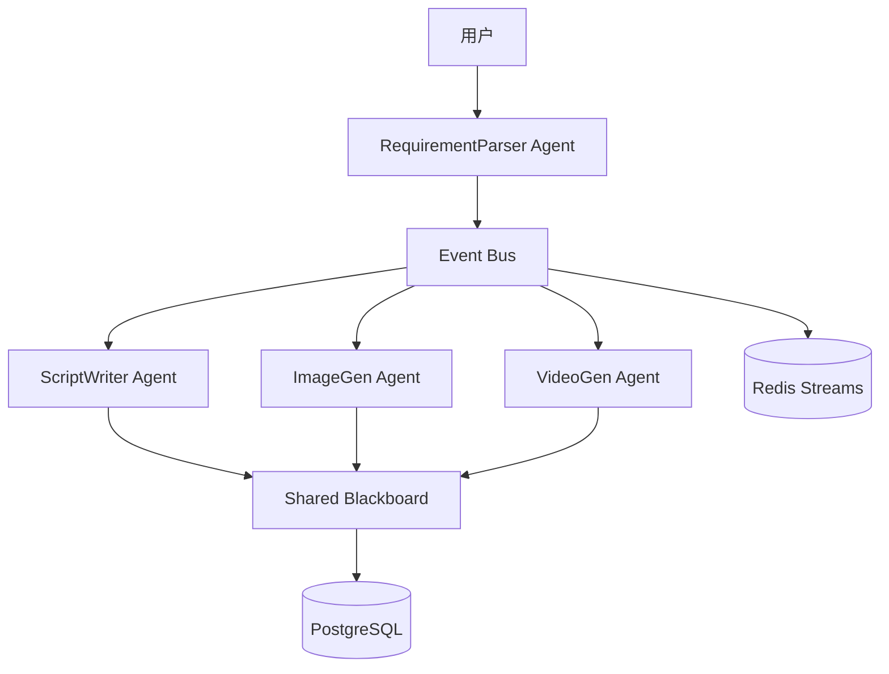

# 快速上手指南

> 欢迎加入 LivingAgentPipeline 项目！本指南将帮助你快速开始开发。

---

## 📋 前置要求

- Python 3.9+
- Docker 和 Docker Compose
- Git
- VS Code（推荐）

---

## 🚀 5 分钟快速开始

### Step 1: 克隆项目

```bash
# 克隆项目（假设你有访问权限）
git clone <repository-url>
cd livingagent-pipeline

# 创建并激活虚拟环境
python -m venv venv
source venv/bin/activate  # Windows: venv\Scripts\activate

# 安装依赖
pip install -r requirements.txt
```

### Step 2: 启动基础设施

```bash
# 启动 Redis（Event Bus 依赖）
docker-compose up -d

# 验证 Redis 运行
docker ps
```

### Step 3: 运行示例

```bash
# 运行 Event Bus 示例
python examples/event_bus_example.py

# 运行测试
pytest tests/ -v
```

### Step 4: 查看文档

```bash
# 阅读关键文档
- 设计文档: docs/LivingAgentPipeline_v2_Unified_Design.md
- 项目结构: PROJECT_STRUCTURE.md
- 开发规范: contracts/DEVELOPMENT_STANDARDS.md
- 契约指南: docs/CONTRACT_GUIDE.md
```

---

## 🎯 开发你的第一个 Agent

### 创意：HelloWorldAgent

让我们创建一个简单的 Agent，它监听用户提交需求的事件，并打印欢迎消息。

### Step 1: 创建 Agent 目录

```bash
mkdir -p src/agents/hello_world
cd src/agents/hello_world
```

### Step 2: 创建 Agent 文件

**`agent.py`**

```python
"""
HelloWorldAgent - 演示 Agent

职责:
- 监听 REQUIREMENT_SUBMITTED 事件
- 打印欢迎消息
- 发布 HELLO_COMPLETED 事件
"""

import logging
from typing import List
from src.infrastructure.event_bus import EventSubscriber, Event, EventType

logger = logging.getLogger(__name__)


class HelloWorldAgent(EventSubscriber):
    """Hello World Agent 演示"""
    
    def __init__(self, name: str = "HelloWorldAgent"):
        super().__init__(name)
        # 订阅用户需求提交事件
        self.subscribe_to([
            EventType.REQUIREMENT_SUBMITTED,
        ])
        logger.info(f"{self.name} initialized")
    
    async def handle_event(self, event: Event) -> None:
        """
        处理事件
        
        Args:
            event: 接收到的事件
        """
        logger.info(f"{self.name} received event: {event.event_type}")
        
        if event.event_type == EventType.REQUIREMENT_SUBMITTED:
            await self._handle_requirement_submitted(event)
    
    async def _handle_requirement_submitted(self, event: Event) -> None:
        """处理需求提交事件"""
        # 从事件中读取用户需求
        requirement = event.payload.get("requirement", "Unknown")
        
        # 打印欢迎消息
        print(f"🎉 欢迎！我们收到了您的需求：{requirement}")
        print(f"📝 项目 ID: {event.project_id}")
        
        # 发布完成事件
        # （简化版，实际应该通过 Event Bus 发布）
        logger.info(f"Hello World Agent completed for project {event.project_id}")
```

**`__init__.py`**

```python
"""Hello World Agent"""

from .agent import HelloWorldAgent

__all__ = ["HelloWorldAgent"]
```

**`README.md`**

```markdown
# HelloWorldAgent

## 职责

- 监听用户需求提交事件
- 打印欢迎消息

## 订阅事件

- `REQUIREMENT_SUBMITTED`

## 发布事件

- `HELLO_COMPLETED`（示例）

## 使用示例

\`\`\`python
from src.agents.hello_world import HelloWorldAgent
from src.infrastructure.event_bus import EventBus

async def main():
    # 创建 Event Bus
    event_bus = EventBus()
    await event_bus.connect()
    
    # 创建并注册 Agent
    agent = HelloWorldAgent()
    event_bus.subscribe(agent, agent.subscribed_events)
    
    # 启动消费
    await event_bus.start_consuming()

asyncio.run(main())
\`\`\`
```

### Step 3: 创建测试

**`tests/test_hello_world_agent.py`**

```python
"""HelloWorldAgent 测试"""

import pytest
from src.agents.hello_world import HelloWorldAgent
from src.infrastructure.event_bus import Event, EventType


@pytest.fixture
def agent():
    """创建 Agent 实例"""
    return HelloWorldAgent()


@pytest.fixture
def sample_event():
    """创建测试事件"""
    return Event(
        event_id="evt_001",
        project_id="proj_001",
        event_type=EventType.REQUIREMENT_SUBMITTED,
        actor="UserInterface",
        payload={"requirement": "生成一个探险视频"},
        timestamp="2025-12-26T12:00:00Z"
    )


class TestHelloWorldAgent:
    """HelloWorldAgent 测试套件"""
    
    def test_initialization(self, agent):
        """测试：Agent 正确初始化"""
        assert agent.name == "HelloWorldAgent"
        assert EventType.REQUIREMENT_SUBMITTED in agent.subscribed_events
    
    @pytest.mark.asyncio
    async def test_handle_event(self, agent, sample_event, capsys):
        """测试：Agent 处理事件"""
        # Act
        await agent.handle_event(sample_event)
        
        # Assert
        captured = capsys.readouterr()
        assert "欢迎" in captured.out
        assert "proj_001" in captured.out
```

### Step 4: 运行测试

```bash
# 运行测试
pytest tests/test_hello_world_agent.py -v

# 查看覆盖率
pytest tests/test_hello_world_agent.py --cov=src.agents.hello_world
```

### Step 5: 集成到系统

**创建示例程序 `examples/hello_world_example.py`**

```python
"""Hello World Agent 示例"""

import asyncio
import logging
from src.agents.hello_world import HelloWorldAgent
from src.infrastructure.event_bus import EventBus, Event, EventType

logging.basicConfig(level=logging.INFO)
logger = logging.getLogger(__name__)


async def main():
    # 创建 Event Bus
    event_bus = EventBus(redis_url="redis://localhost:6379")
    await event_bus.connect()
    
    # 创建并注册 Agent
    agent = HelloWorldAgent()
    event_bus.subscribe(agent, agent.subscribed_events)
    
    # 启动事件消费
    await event_bus.start_consuming()
    
    # 模拟发布一个需求提交事件
    event = Event(
        event_id="evt_demo_001",
        project_id="proj_demo_001",
        event_type=EventType.REQUIREMENT_SUBMITTED,
        actor="DemoUser",
        payload={"requirement": "生成一个关于探险的视频"},
        timestamp="2025-12-26T12:00:00Z"
    )
    
    await event_bus.publish(event)
    
    # 等待一段时间让 Agent 处理
    await asyncio.sleep(2)
    
    # 停止消费
    await event_bus.stop_consuming()
    await event_bus.disconnect()
    
    logger.info("示例运行完成")


if __name__ == "__main__":
    asyncio.run(main())
```

**运行示例**

```bash
python examples/hello_world_example.py
```

---

## 📚 深入学习

### 理解项目架构



### 核心概念

#### 1. Event Bus（事件总线）

- **作用**：Agent 间的异步通信
- **实现**：Redis Streams
- **特点**：发布-订阅模式，持久化，可重放

```python
# 发布事件
await event_bus.publish(event)

# 订阅事件
event_bus.subscribe(agent, [EventType.YOUR_EVENT])
```

#### 2. Shared Blackboard（共享黑板）

- **作用**：所有 Agent 的共享数据存储
- **实现**：PostgreSQL + Redis 缓存
- **特点**：单一事实来源，版本控制，锁机制

```python
# 读取数据
project = await blackboard.get_project(project_id)

# 写入数据
await blackboard.update_project(project)
```

#### 3. Orchestrator（编排器）

- **作用**：Event → Task 映射，任务调度
- **工作流程**：
  1. 监听 Event
  2. 创建对应的 Task
  3. 分配给合适的 Agent

#### 4. Contract First（契约优先）

- **原则**：先定义数据结构（JSON Schema），再编写代码
- **好处**：类型安全，自动验证，多语言支持

```python
# ✅ 使用契约定义的模型
from src.contracts import create_event, EventType

event = create_event(
    event_type=EventType.IMAGE_GENERATED,
    # ...
)

# ❌ 不要手动构造字典
event = {
    "event_type": "IMAGE_GENERATED",  # 可能拼写错误
    # ...
}
```

---

## 🛠️ 开发工具配置

### VS Code 扩展推荐

```json
{
  "recommendations": [
    "ms-python.python",
    "ms-python.vscode-pylance",
    "ms-python.black-formatter",
    "charliermarsh.ruff",
    "njpwerner.autodocstring"
  ]
}
```

### 代码质量工具

```bash
# 格式化代码
black src/ tests/ --line-length 100

# 代码检查
flake8 src/ tests/ --max-line-length 100

# 类型检查
mypy src/ --strict

# 测试覆盖率
pytest tests/ --cov=src --cov-report=html
```

### Pre-commit Hook（可选）

```bash
# 安装 pre-commit
pip install pre-commit

# 创建 .pre-commit-config.yaml
cat > .pre-commit-config.yaml << EOF
repos:
  - repo: https://github.com/psf/black
    rev: 23.3.0
    hooks:
      - id: black
        args: [--line-length=100]
  
  - repo: https://github.com/pycqa/flake8
    rev: 6.0.0
    hooks:
      - id: flake8
        args: [--max-line-length=100]
EOF

# 安装 hook
pre-commit install
```

---

## 🤔 常见问题

### Q1: Event Bus 连接失败？

**A**: 确保 Redis 正在运行

```bash
# 检查 Docker 容器
docker ps | grep redis

# 如果没有运行，启动它
docker-compose up -d
```

### Q2: 如何调试 Agent？

**A**: 使用日志和断点

```python
import logging
logger = logging.getLogger(__name__)

# 在关键位置添加日志
logger.debug(f"Processing event: {event}")

# VS Code 中设置断点
# 在代码行左侧点击添加红点
```

### Q3: 测试覆盖率不够怎么办？

**A**: 查看覆盖率报告，补充测试

```bash
# 生成 HTML 报告
pytest tests/ --cov=src --cov-report=html

# 在浏览器中打开
open htmlcov/index.html  # macOS
# start htmlcov/index.html  # Windows
```

### Q4: 如何添加新的 Event Type？

**A**: 遵循契约优先流程

1. 在 `contracts/1_event/event_type.enum.json` 添加新枚举值
2. 重新生成 TypeScript 类型：`cd contracts && npm run generate-types`
3. 更新 Python Event 类型：`src/infrastructure/event_bus/event.py`
4. 更新文档

### Q5: 如何查看因果链？

**A**: 使用 Event Bus 的追踪功能

```python
# 获取事件的完整因果链
chain = await event_bus.get_causation_chain(event_id)

# 打印因果链
for event in chain:
    print(f"{event.event_type} -> {event.event_id}")
```

---

## 📖 下一步学习

### 推荐阅读顺序

1. ✅ **本指南**（你在这里）
2. 📘 [开发规范](file:///d:/下载/contracts/DEVELOPMENT_STANDARDS.md) - 详细的开发规范
3. 📐 [设计文档](file:///d:/文档/Kiro/VIdeoGen/LivingAgentPipeline_v2_Unified_Design.md) - 系统架构设计
4. 🏗️ [项目结构](file:///d:/文档/Kiro/VIdeoGen/PROJECT_STRUCTURE.md) - 代码组织
5. 📜 [契约指南](file:///d:/文档/Kiro/VIdeoGen/docs/CONTRACT_GUIDE.md) - 契约使用

### 实践任务

- [ ] 创建一个自定义 Agent
- [ ] 编写完整的单元测试（覆盖率 > 80%）
- [ ] 实现一个完整的 Event → Task → Event 循环
- [ ] 提交你的第一个 Pull Request

---

## 💬 获取帮助

### 文档

- 查看 `docs/` 目录中的详细文档
- 阅读现有 Agent 的代码（如 `src/infrastructure/event_bus/`）

### 团队

- 在项目 Issue 中提问
- Code Review 时请教 Reviewer
- 参加团队技术分享会

---

**快速上手指南版本**: 1.0  
**最后更新**: 2025-12-26

🎉 **欢迎加入项目！祝你编码愉快！**
