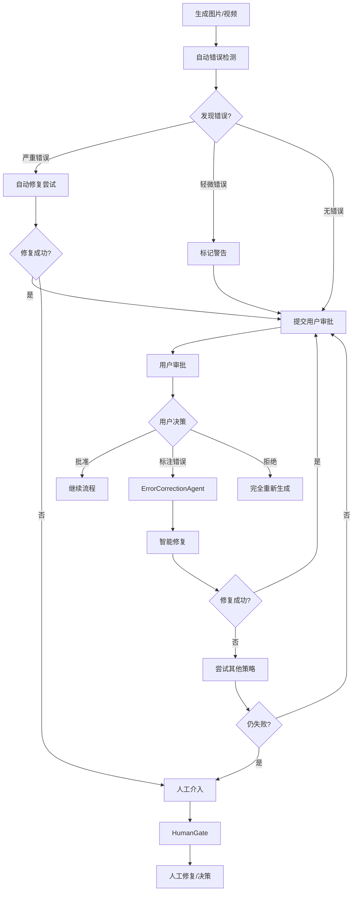

# 进一步优化方案分析

## 优化方向概述

基于用户提出的三个优化方向，本文档提供详细的分析和实施方案：

1. **融入图像编辑模型**（如 Qwen-Image-Edit）- 支持视角调整和精细编辑
2. **竞品分析**（Lovart、TapNow）- 了解市场定位和差异化优势
3. **增强错误修正机制** - 自动检测和用户反馈的双重保障

---

## 优化 1: 融入图像编辑模型

### 背景分析

**Qwen-Image-Edit 等模型的核心能力**:
- 基于文本指令的图像编辑
- 视角调整（camera angle, perspective）
- 局部修改（人物姿态、表情、服装）
- 风格迁移和细节优化
- 保持主体一致性的前提下进行编辑

**应用场景**:
- 用户对生成的关键帧不满意，需要微调
- 调整人物视角（正面 → 侧面）
- 修正人物动作或表情
- 优化构图和光影

### 集成方案

#### 方案 A: 新增 ImageEditAgent


**架构设计**:
```
用户审批关键帧
    ↓
选择"修改"并提供编辑指令
    ↓
ImageEditAgent 接收编辑请求
    ↓
调用 Qwen-Image-Edit / ControlNet
    ↓
生成编辑后的图像
    ↓
再次提交用户审批
```

**核心能力**:
```python
class ImageEditAgent:
    def __init__(self):
        self.adapters = {
            "qwen-image-edit": QwenImageEditAdapter(),
            "controlnet-inpaint": ControlNetInpaintAdapter(),
            "instruct-pix2pix": InstructPix2PixAdapter()
        }
    
    def edit_image(self, edit_request):
        """基于用户指令编辑图像"""
        original_image = self.load_image(edit_request.image_url)
        instruction = edit_request.instruction
        
        # 选择合适的编辑模型
        adapter = self.select_adapter(instruction)
        
        result = adapter.edit(
            image=original_image,
            instruction=instruction,
            preserve_identity=True,  # 保持人物一致性
            strength=0.7  # 编辑强度
        )
        
        # 验证编辑质量
        quality_score = self.evaluate_edit_quality(
            original_image,
            result.edited_image,
            instruction
        )
        
        if quality_score < 0.7:
            # 尝试其他模型或参数
            return self.retry_with_alternative(edit_request)
        
        return {
            "edited_image_url": self.storage.upload(result.edited_image),
            "quality_score": quality_score,
            "changes_applied": result.changes_summary
        }
    
    def select_adapter(self, instruction):
        """根据指令类型选择编辑模型"""
        if "视角" in instruction or "angle" in instruction.lower():
            return self.adapters["qwen-image-edit"]
        elif "修复" in instruction or "inpaint" in instruction.lower():
            return self.adapters["controlnet-inpaint"]
        else:
            return self.adapters["instruct-pix2pix"]
```

**集成到现有流程**:
1. 在用户审批界面添加"编辑"按钮
2. 用户输入编辑指令（如"将视角改为侧面 45 度"）
3. ImageEditAgent 执行编辑
4. 更新 Blackboard 中的 keyframe
5. 保留编辑历史，支持撤销

**优势**:
- ✅ 提供精细化控制能力
- ✅ 减少完全重新生成的成本
- ✅ 保持视觉一致性（基于原图编辑）
- ✅ 支持迭代优化

**挑战**:
- ⚠️ 编辑模型的质量和稳定性
- ⚠️ 复杂指令的理解和执行
- ⚠️ 编辑后可能破坏 DNA 一致性

#### 方案 B: 扩展 ImageGenAgent 的编辑能力

将编辑能力集成到现有的 ImageGenAgent 中，作为一种特殊的生成模式。

**优势**: 架构简单，无需新增 Agent  
**劣势**: ImageGenAgent 职责过重

**推荐**: 采用方案 A，保持职责分离

---

## 优化 2: 竞品分析与差异化

### 竞品概览

#### Lovart (爱画画)

**核心功能**:
- AI 绘画生成（文生图、图生图）
- 风格化处理
- 社区分享和模板库
- 移动端优先

**技术特点**:
- 基于 Stable Diffusion
- 预设风格模板
- 快速生成（< 30 秒）

**目标用户**:
- 个人创作者
- 社交媒体内容创作
- 非专业用户

#### TapNow

**核心功能**:
- 短视频 AI 生成
- 模板驱动的创作
- 一键生成营销视频
- 素材库和音乐库

**技术特点**:
- 模板化流程
- 有限的自定义能力
- 快速交付（< 5 分钟）

**目标用户**:
- 电商卖家
- 营销人员
- 小企业主

### 我们的差异化优势

#### 1. 专业级视频生成能力

| 维度 | Lovart/TapNow | 我们的方案 |
|------|---------------|-----------|
| 内容类型 | 静态图片 / 简单视频 | 完整叙事视频（30-60秒） |
| 剧本能力 | 无 / 模板化 | AI 自动编剧 + 分镜 |
| 视觉一致性 | 单张图片 | 跨镜头 DNA 管理 |
| 音频集成 | 背景音乐 | 配音 + 音乐 + 口型同步 |
| 质量控制 | 基础过滤 | 多层 QA + 自动修复 |

#### 2. 智能 Agent 协作

**我们的优势**:
- 12 个专业 Agent 分工协作
- 自动化的质量检测和修复
- 跨模态一致性保证
- 成本优化和预算控制

**竞品局限**:
- 单一模型生成
- 有限的质量控制
- 无法处理复杂场景

#### 3. 用户控制与审批

**我们的优势**:
- 关键阶段用户审批
- 支持修改意见和迭代
- 灵活的自动/手动模式切换
- 完整的生成历史和版本管理

**竞品局限**:
- 一次性生成，难以修改
- 有限的参数调整
- 无法精细控制流程

#### 4. 企业级能力

**我们的优势**:
- 成本透明和预测
- 批量生产能力
- API 集成支持
- 私有化部署选项

**竞品局限**:
- 面向 C 端，无企业功能
- 无成本控制
- 无 API 支持

### 市场定位建议

**目标用户**:
- 🎬 **专业内容创作者**: 需要高质量叙事视频
- 🏢 **企业营销团队**: 批量生产品牌视频
- 📱 **MCN 机构**: 规模化内容生产
- 🎓 **教育机构**: 教学视频制作

**差异化策略**:
1. **质量优先**: 强调专业级输出，而非快速生成
2. **可控性**: 突出用户审批和迭代能力
3. **一致性**: 强调跨镜头的视觉统一
4. **智能化**: 展示 AI Agent 的协作能力

**定价策略**:
- Lovart/TapNow: $10-30/月（C 端订阅）
- 我们: $100-500/月（专业版）+ 按量计费

---

## 优化 3: 增强错误修正机制

### 3.1 自动错误检测

#### 扩展 ConsistencyGuardian 的检测能力

**新增检测项**:

```python
class ConsistencyGuardian:
    def detect_visual_errors(self, artifact):
        """检测视觉错误"""
        errors = []
        
        # 1. 人物动作错误检测
        pose_errors = self.check_pose_validity(artifact)
        if pose_errors:
            errors.append({
                "type": "INVALID_POSE",
                "severity": "high",
                "description": "人物姿态不自然或解剖学错误",
                "details": pose_errors,
                "suggested_fix": "重新生成或使用 ControlNet 修正"
            })
        
        # 2. 手部错误检测（AI 生成常见问题）
        hand_errors = self.check_hand_quality(artifact)
        if hand_errors:
            errors.append({
                "type": "HAND_DEFECT",
                "severity": "medium",
                "description": "手部细节错误（多指、变形等）",
                "details": hand_errors,
                "suggested_fix": "使用 inpainting 修复或重新生成"
            })
        
        # 3. 面部错误检测
        face_errors = self.check_face_quality(artifact)
        if face_errors:
            errors.append({
                "type": "FACE_DEFECT",
                "severity": "high",
                "description": "面部特征错误或不一致",
                "details": face_errors,
                "suggested_fix": "调整 prompt 或使用 face restoration"
            })
        
        # 4. 物理规律违背检测
        physics_errors = self.check_physics_validity(artifact)
        if physics_errors:
            errors.append({
                "type": "PHYSICS_VIOLATION",
                "severity": "medium",
                "description": "违反物理规律（如悬浮、穿模）",
                "details": physics_errors,
                "suggested_fix": "调整 prompt 或重新生成"
            })
        
        # 5. 文字错误检测（如果有文字）
        text_errors = self.check_text_quality(artifact)
        if text_errors:
            errors.append({
                "type": "TEXT_ERROR",
                "severity": "low",
                "description": "文字模糊或错误",
                "details": text_errors,
                "suggested_fix": "后期添加文字或使用专门的文字生成"
            })
        
        return errors
    
    def check_pose_validity(self, image):
        """检测人物姿态是否合理"""
        # 使用 OpenPose 或类似模型检测骨骼点
        keypoints = self.pose_detector.detect(image)
        
        errors = []
        
        # 检查关节角度是否合理
        for joint, angle in keypoints.joint_angles.items():
            if not self.is_valid_joint_angle(joint, angle):
                errors.append(f"{joint} 角度异常: {angle}°")
        
        # 检查肢体比例
        if not self.check_body_proportions(keypoints):
            errors.append("身体比例不协调")
        
        return errors
    
    def check_hand_quality(self, image):
        """检测手部质量"""
        hands = self.hand_detector.detect(image)
        
        errors = []
        for hand in hands:
            # 检查手指数量
            if hand.finger_count != 5:
                errors.append(f"手指数量错误: {hand.finger_count}")
            
            # 检查手部形态
            if hand.deformation_score > 0.3:
                errors.append("手部变形")
        
        return errors
```

**检测时机**:
1. **关键帧生成后**: 立即检测
2. **预览视频生成后**: 检测每一帧
3. **最终视频生成后**: 全面检测

**检测结果处理**:
```python
def handle_detection_results(self, errors):
    """处理检测结果"""
    if not errors:
        return {"status": "PASS"}
    
    # 按严重程度分类
    critical_errors = [e for e in errors if e["severity"] == "high"]
    medium_errors = [e for e in errors if e["severity"] == "medium"]
    minor_errors = [e for e in errors if e["severity"] == "low"]
    
    # 决策逻辑
    if critical_errors:
        # 严重错误：自动重试或人工介入
        return {
            "status": "CRITICAL_FAIL",
            "action": "AUTO_RETRY",
            "errors": critical_errors,
            "retry_strategy": self.generate_retry_strategy(critical_errors)
        }
    
    elif len(medium_errors) > 2:
        # 多个中等错误：建议重新生成
        return {
            "status": "FAIL",
            "action": "REGENERATE",
            "errors": medium_errors
        }
    
    elif medium_errors or minor_errors:
        # 轻微错误：标记但继续，用户审批时提示
        return {
            "status": "WARN",
            "action": "CONTINUE_WITH_WARNING",
            "errors": medium_errors + minor_errors
        }
```

### 3.2 用户反馈的错误修正

#### 增强用户审批界面

**错误标注功能**:
```typescript
interface UserFeedback {
  approval_id: string;
  decision: "approve" | "revise" | "reject";
  
  // 新增：错误标注
  error_annotations?: ErrorAnnotation[];
  
  revision_notes?: string;
}

interface ErrorAnnotation {
  type: "pose" | "hand" | "face" | "physics" | "other";
  location: {
    x: number;
    y: number;
    width: number;
    height: number;
  };  // 用户圈选的区域
  description: string;  // 用户描述的问题
  severity: "critical" | "medium" | "minor";
}
```

**UI 设计**:
1. **标注工具**: 用户可以在图片/视频上圈选问题区域
2. **问题分类**: 快速选择问题类型（姿态/手部/面部等）
3. **描述输入**: 详细描述问题
4. **修复建议**: 系统根据问题类型提供修复选项

#### 智能修复策略

```python
class ErrorCorrectionAgent:
    def correct_error(self, error_annotation, original_artifact):
        """根据用户标注修正错误"""
        error_type = error_annotation.type
        location = error_annotation.location
        
        if error_type == "hand":
            # 手部修复：使用 inpainting
            return self.inpaint_hand(
                original_artifact,
                location,
                reference_hands=self.get_reference_hands()
            )
        
        elif error_type == "face":
            # 面部修复：使用 face restoration
            return self.restore_face(
                original_artifact,
                location,
                identity_embedding=self.get_character_dna()
            )
        
        elif error_type == "pose":
            # 姿态修复：使用 ControlNet + Pose
            correct_pose = self.suggest_correct_pose(
                error_annotation.description
            )
            return self.regenerate_with_pose_control(
                original_artifact,
                correct_pose
            )
        
        elif error_type == "physics":
            # 物理错误：通常需要重新生成
            improved_prompt = self.improve_prompt_for_physics(
                original_artifact.prompt,
                error_annotation.description
            )
            return self.regenerate_with_prompt(improved_prompt)
        
        else:
            # 其他错误：使用通用编辑模型
            return self.generic_edit(
                original_artifact,
                location,
                error_annotation.description
            )
```

### 3.3 修正流程设计



### 3.4 修正策略优先级

**Level 1: 局部修复（优先）**
- 使用 inpainting 修复局部问题
- 成本低，速度快
- 保持整体一致性

**Level 2: 控制重生成**
- 使用 ControlNet + 原图作为参考
- 保持构图和主体
- 修正特定问题

**Level 3: 完全重新生成**
- 优化 prompt
- 调整参数
- 最后手段

**Level 4: 人工介入**
- 专业修图师手动修复
- 或提供替代方案

---

## 实施建议

### 优先级排序

**P0（立即实施）**:
1. ✅ 增强错误检测能力（手部、面部、姿态）
2. ✅ 用户错误标注界面
3. ✅ 基础的 inpainting 修复

**P1（3 个月内）**:
1. 🔄 集成 ImageEditAgent
2. 🔄 智能修复策略
3. 🔄 竞品差异化营销

**P2（6 个月内）**:
1. 📋 高级编辑能力（视角调整）
2. 📋 批量修复工具
3. 📋 修复效果学习优化

### 成本影响

**新增成本**:
- ImageEditAgent: 每次编辑 $0.01-0.05
- 错误检测: 每张图片 $0.001
- Inpainting 修复: 每次 $0.02

**节省成本**:
- 减少完全重新生成: 节省 60-80%
- 提高一次通过率: 减少迭代次数

**ROI**: 预计 3-6 个月回本

---

## 总结

三个优化方向都非常有价值，建议按优先级逐步实施：

1. **错误修正机制**（P0）- 直接提升用户满意度
2. **图像编辑能力**（P1）- 增强产品竞争力
3. **差异化定位**（持续）- 明确市场策略

这些优化将使我们的系统更加智能、可控、专业，形成明显的竞争优势。
